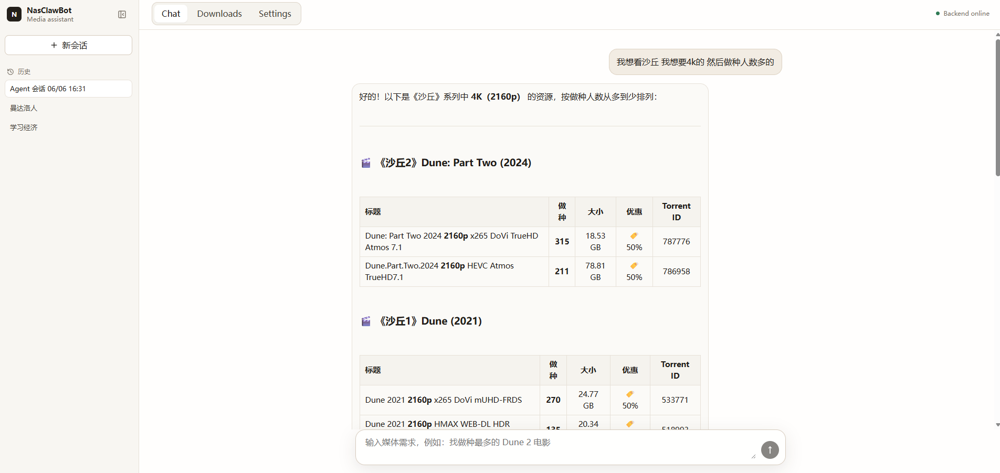

# Personal Media Agent

面向 NAS 家庭用户的自然语言影视助手。让不熟悉 NAS 和资源站的家人也能用一句话找到想看的影视内容——无需手动搜索、比对各版本、操作下载器，Agent 会理解意图、搜索资源、整理候选，并在下载前等待确认。

## 截图




## 核心特性

- **自然语言搜索** — 输入想看的内容，Agent 自动选择合适的搜索参数
- **Agent 多工具调用** — LLM 自主决定调用搜索、个人信息查询还是下载工具
- **人在回路审批** — 下载操作暂停并等待用户确认，杜绝误操作
- **多会话管理** — 支持多条独立对话，可重命名、删除、自由切换
- **上下文压缩** — 长对话自动压缩摘要，保持对话连贯的同时节省 token
- **安全沙箱** — 只读工具自动执行，副作用工具需审批，无文件系统操作暴露

## 架构概览

```text
┌──────────────┐     ┌──────────────────────────────────────┐
│   Browser    │     │           FastAPI Server              │
│              │     │                                      │
│  React SPA  ─┼────►│  /chat        → MTeamSearchTool      │
│              │     │  /chat/agent  → NasClawAgentRunner    │
│  Chat Panel  │     │  /download    → QBAddTorrentTool      │
│  Sidebar     │     │  /qb/*        → QBittorrentAdapter    │
│  Downloads   │     │                                      │
└──────────────┘     └──────────┬───────────────────────────┘
                                │
                   ┌────────────▼────────────┐
                   │   NasClawAgentRunner     │
                   │                          │
                   │  ToolCallingAgent        │
                   │  ┌────────────────────┐  │
                   │  │ Filter (tool list) │  │
                   │  │ Gate  (exec check) │  │
                   │  │ Loop  (max_steps)  │  │
                   │  └────────────────────┘  │
                   │                          │
                   │  Tools:                  │
                   │  - mteam_search  READ    │
                   │  - member_profile READ   │
                   │  - qb_add_torrent GATED  │
                   └──────────┬───────────────┘
                              │
                   ┌──────────▼───────────┐
                   │      Adapters        │
                   │  MTeamAdapter        │
                   │  QBittorrentAdapter  │
                   └──────────┬───────────┘
                              │
                   ┌──────────▼───────────┐
                   │   External Services  │
                   │  M-Team API          │
                   │  qBittorrent API     │
                   │  DeepSeek API        │
                   └──────────────────────┘
```

## 技术栈

| 层       | 技术                                        |
| -------- | ------------------------------------------- |
| 前端     | React 19, TypeScript, Vite, react-markdown  |
| 后端     | Python 3.11+, FastAPI, uvicorn              |
| Agent 框架 | HelloAgents (基于 Datawhale Hello-Agents 二次开发) |
| LLM      | DeepSeek (OpenAI 兼容 API)                  |
| 外部集成 | M-Team API, qBittorrent API                 |
| 持久化   | JSON 文件 checkpoint                        |

### HelloAgents 二次开发

上游框架 [Hello-Agents](https://github.com/datawhalechina/hello-agents) 提供了 Agent 基类、LLM 适配、消息历史、工具注册等核心抽象。在此基础上新增和修改了以下内容，设计理念参考了 Claude Code 的 Tool Use 循环与 Nous Research Hermes Agent 的推理模式：

**新增模块：**

| 模块 | 说明 |
|------|------|
| `hello_agents/loop/tool_calling_loop.py` | 生产级工具调用循环引擎：Filter/Gate 集成、审批暂停/恢复、max_steps 强制终结、结构化 ToolObservation |
| `hello_agents/context/window_manager.py` | 上下文窗口预检与智能压缩：在上下文压力达到阈值前主动压缩历史消息，保留最近 N 轮活跃对话 |
| `hello_agents/tools/gate.py` | 三层闸门执行控制：deny（拒绝危险调用）→ confirm（需用户审批）→ allow（直接执行），支持参数感知的规则匹配 |
| `hello_agents/tools/filter.py` | LLM 调用前工具可见性过滤：按名称或谓词缩减工具列表，控制 context window 消耗和子 Agent 能力范围 |
| `hello_agents/agents/tool_calling_agent.py` | 面向生产场景的 ToolCallingAgent 预设，集成上下文压缩与循环引擎 |
| `hello_agents/checkpoints/store.py` | 对话 checkpoint 协议：定义跨请求持久化的 load/save/list/delete 接口 |
| `hello_agents/checkpoints/json_store.py` | JSON 文件 checkpoint 实现：原子写入、会话列表、完整历史恢复 |

**修改的上游模块：**

| 模块 | 变更 |
|------|------|
| `hello_agents/core/agent.py` | 集成 HistoryManager、ContextWindowManager、压缩检查与归档 |
| `hello_agents/core/config.py` | 新增 `preflight_compression_enabled`、`smart_compression`、`context_window` 等配置 |
| `hello_agents/tools/base.py` | `ToolParameter` 扩展 `enum` 约束支持 |
| `hello_agents/tools/response.py` | 扩展 `ToolResponse` 结构，新增 `ToolStatus`、错误信息等字段 |

**移除的上游模块：**

| 模块 | 原因 |
|------|------|
| `hello_agents/tools/tool_filter.py` | 被 Filter + Gate 双层模型替代 |
| `hello_agents/tools/permissions.py` | 被 Gate 统一处理 |

## 前置条件

- Python 3.11+
- Node.js 20.19+ / 22.12+
- [M-Team](https://www.m-team.cc/) 账号及 API Key
- qBittorrent 实例 (Web UI 已启用)
- DeepSeek API Key (或任意 OpenAI 兼容 LLM)

## 快速开始

```bash
# 1. 克隆仓库
git clone <repo-url>
cd NasClawBot

# 2. 创建虚拟环境并安装依赖
python -m venv .venv
.venv/bin/pip install -e .

# 3. 配置环境变量
cp .env.example .env   # 编辑 .env 填入实际配置

# 4. 启动后端
.venv/bin/python -m uvicorn app.main:app --host 127.0.0.1 --port 8000

# 5. 安装前端依赖并启动
cd frontend
npm install
npm run dev
```

浏览器打开 `http://127.0.0.1:8000` 即可使用。

## 配置说明

根目录 `.env` 文件：

| 变量               | 说明                          | 默认值                     |
| ------------------ | ----------------------------- | -------------------------- |
| `MTEAM_BASE_URL`   | M-Team API 地址               | (必填)                     |
| `MTEAM_API_KEY`    | M-Team API Key                | (必填)                     |
| `QB_BASE_URL`      | qBittorrent Web UI 地址       | (必填)                     |
| `QB_USERNAME`      | qBittorrent 用户名            | (必填)                     |
| `QB_PASSWORD`      | qBittorrent 密码              | (必填)                     |
| `LLM_MODEL`        | LLM 模型名                    | `deepseek-v4-pro`          |
| `LLM_API_KEY`      | LLM API Key                   | (必填)                     |
| `LLM_BASE_URL`     | LLM API 地址                  | `https://api.deepseek.com` |
| `LLM_REASONING_SPLIT` | 分离推理内容与最终回复     | `true`                     |
| `LOG_LEVEL`        | 日志级别                      | `INFO`                     |
| `DATABASE_PATH`    | SQLite 数据库路径 (预留)      | `nas_media_agent.db`       |

## 项目结构

```text
NasClawBot/
├── app/                        # 应用层
│   ├── adapters/               #   外部 API 适配器
│   │   ├── mteam.py            #     M-Team 搜索与下载链接
│   │   └── qbittorrent.py      #     qBittorrent 任务管理
│   ├── agent/                  #   Agent 运行层
│   │   ├── runner.py           #     NasClawAgentRunner: 会话生命周期
│   │   └── approvals.py        #     审批记录与生命周期
│   ├── api/                    #   HTTP 路由与 Schema
│   │   ├── chat_routes.py      #     /chat, /chat/agent, /download, sessions CRUD
│   │   ├── qb_routes.py        #     /qb/* 任务管理
│   │   └── schemas.py          #     Pydantic 请求/响应模型
│   ├── tools/                  #   Agent 工具
│   │   ├── mteam_search.py     #     搜索 M-Team (只读)
│   │   ├── member_profile.py   #     查询个人数据 (只读)
│   │   └── qb_add_torrent.py  #     提交下载 (需审批)
│   ├── domain/models.py        #   领域模型 (ResourceCandidate 等)
│   ├── config.py               #   环境变量配置
│   └── main.py                 #   FastAPI 入口
├── hello_agents/               # Agent 框架 (HelloAgents 二次开发)
│   ├── agents/                 #   多种 Agent 范式
│   ├── tools/                  #   工具系统: Filter, Gate, Registry
│   ├── loop/                   #   ToolCallingLoop 循环引擎
│   ├── context/                #   上下文窗口管理与压缩
│   ├── checkpoints/            #   对话 checkpoint 持久化
│   └── core/                   #   LLM, Message, Config 等核心抽象
├── frontend/                   # React 前端
│   └── src/
│       ├── app/                #   AppShell, theme
│       ├── components/         #   chat/, layout/, downloads/, settings/
│       ├── hooks/              #   useAgentChatSession
│       ├── state/              #   状态管理
│       └── api/                #   HTTP 客户端
├── docs/                       # 设计文档与归档
│   ├── design/                 #   活跃设计文档
│   └── archive/                #   历史架构与决策记录
├── memory/                     # 运行时数据
│   └── agent-sessions/         #   JSON checkpoint 文件
├── tests/                      # 后端测试
└── ref/                        # 外部 API 参考文档
```

## API 概览

| 方法     | 路径                                                              | 说明                              |
| -------- | ----------------------------------------------------------------- | --------------------------------- |
| `POST`   | `/chat`                                                           | 只读搜索 (无 LLM)                 |
| `POST`   | `/chat/agent`                                                     | Agent 对话 (LLM + 工具调用)       |
| `GET`    | `/chat/agent/sessions`                                            | 列出所有会话                      |
| `GET`    | `/chat/agent/sessions/{id}`                                       | 获取会话详情与历史消息            |
| `PATCH`  | `/chat/agent/sessions/{id}`                                       | 更新会话 (重命名)                 |
| `DELETE` | `/chat/agent/sessions/{id}`                                       | 删除会话                          |
| `POST`   | `/chat/agent/sessions/{id}/approvals/{approval_id}/approve`       | 批准下载请求                      |
| `POST`   | `/chat/agent/sessions/{id}/approvals/{approval_id}/deny`          | 拒绝下载请求                      |
| `POST`   | `/download`                                                       | 直接提交下载到 qBittorrent (暂停) |
| `GET`    | `/qb/torrents`                                                    | 列出 qBittorrent 任务             |
| `POST`   | `/qb/torrents/{hash}/action`                                      | 控制 qBittorrent 任务             |
| `GET`    | `/health`                                                         | 健康检查                          |

## 设计决策

以下是开发过程中遇到的关键决策点，记录于此便于回顾与面试准备。

### 为什么基于 HelloAgents 二次开发而不是直接用 LangChain？

> *待补充*

### 为什么下载必须暂停并等待用户审批？

> *待补充*

### Filter + Gate 双层安全模型的设计考量

> *待补充*

### 当前阶段为什么用 JSON checkpoint 而不是 SQLite？

> *待补充*

### 为什么 Agent 循环限制 max_steps 并强制最后一次不带工具调用？

> *待补充*

### 会话级串行锁的设计动机

> *待补充*

## 路线图

### V1：自然语言媒体搜索 (已完成)

- [x] 对话入口与多会话管理
- [x] Agent 驱动的 M-Team 搜索
- [x] 搜索结果结构化展示
- [x] 人在回路下载审批
- [x] qBittorrent 任务管理面板

### V2：媒体库整理 Agent (规划中)

> 减少手动管理 NAS 的成本。

- [ ] 自动重命名
- [ ] 刮削状态检查
- [ ] 缺集检测
- [ ] 重复版本检测
- [ ] 字幕状态检查

### V3：订阅与追更系统 (规划中)

> 从"用户主动找"变成"系统主动提醒"。

- [ ] 新剧/番剧订阅
- [ ] 更新提醒
- [ ] 缺集补全提醒
- [ ] 通知系统

### V4：个性化推荐 Agent (规划中)

> 基于长期记忆和上下文做推荐。

- [ ] 用户偏好画像
- [ ] 观看历史追踪
- [ ] 家庭成员画像
- [ ] 推荐理由生成

### V5：多 Agent 化与自动运维 (规划中)

> 让系统具备更强自主性。

- [ ] Planner / Library / Recommendation / Subscription Agent
- [ ] Error Recovery Agent
- [ ] 任务日志与可视化面板
