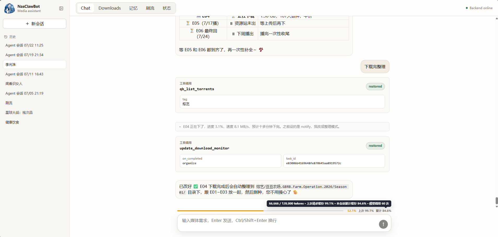
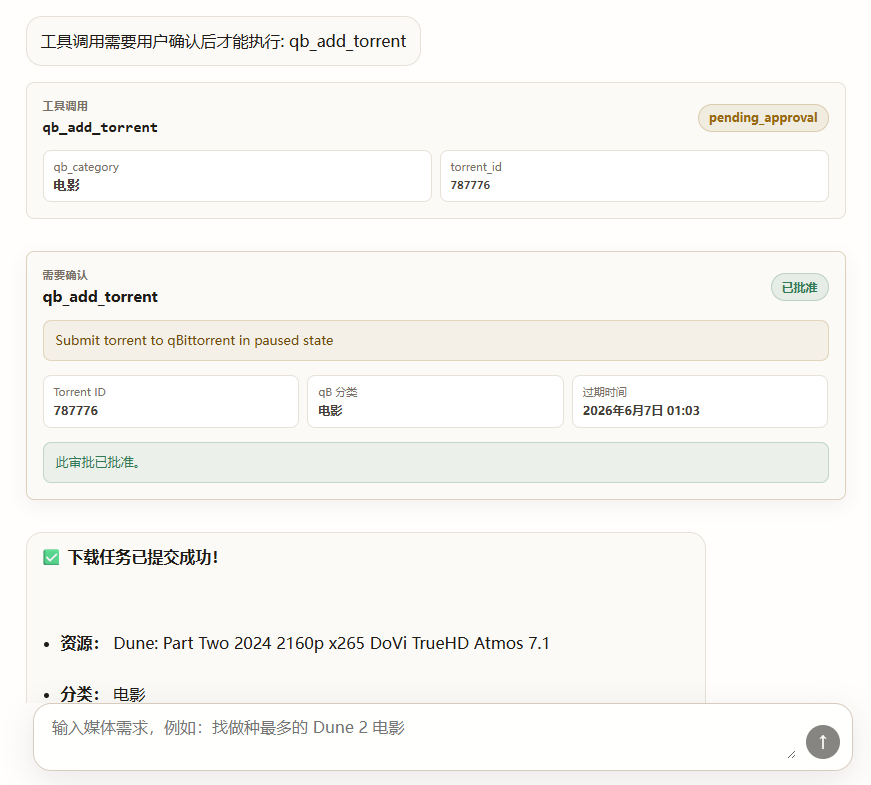
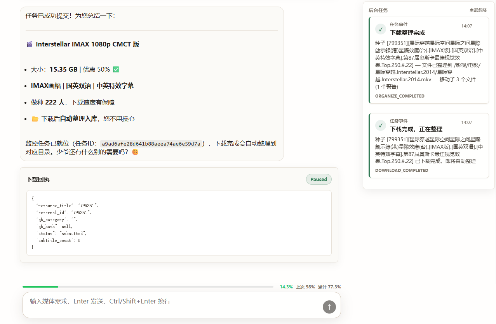

<p align="center">
  
</p>

# NasClawBot

<p align="center">
  <strong>自然语言驱动的 NAS/PT 媒体助手 · Agent 工程实践平台</strong>
</p>

<p align="center">
  
  
  
  
  
</p>

> **声明 Disclaimer**
>
> 本项目是一个**个人学习与 Agent 工程实验项目**，主要用于探索 LLM Agent 的工具安全、人在回路审批、后台任务调度等工程问题。
>
> - 当前仅适配 **飞牛 OS (Debian)** 部署环境与 **M-Team** 种子站。
> - **不适配**其他 PT 站点，也不提供任何影视资源或违反当地法律法规的获取方式。
> - 所有下载功能默认暂停，需要用户明确审批后才能开始。
> - 本项目不包含任何内置影视内容、种子文件或资源链接。

## 截图

<p align="center">
  
</p>

<p align="center">
  
</p>

<p align="center">
  
</p>


## 功能特性

- **自然语言媒体搜索**：Agent 会在 Tavily、TMDB、M-Team 之间选择合适工具，先澄清模糊/近期/系列问题，再搜索具体 PT 资源。
- **结构化候选结果**：M-Team 候选会显示标题、体积、分辨率、做种/下载人数、优惠状态、中文字幕信号等关键判断信息。
- **人在回路下载审批**：qB 下载、批量下载、限速和控制类动作必须审批；所有下载提交到 qBittorrent 时默认暂停。
- **会话级下载授权**：符合 Settings 策略的下载审批可以选择"本会话内允许"，后续同会话、同约束内的下载无需重复确认。
- **Agent 驱动的下载监督**：Agent 可明确创建一次检查或持续监督，并在审批卡中声明完成后通知或整理；任务意图持久化到 SQLite，服务重启后继续执行。
- **自动下载后整理**：完成动作选择整理时，系统捕获不可扩张的授权快照，下载完成后再由受限 WorkerAgent 加载命名规则并执行整理。
- **多会话工作区**：支持会话列表、刷新恢复、重命名、删除、新建对话；每个会话都有独立 checkpoint。
- **长对话上下文管理**：128K 默认上下文窗口，70% 压力触发智能压缩，保留最近 4 轮活跃消息并归档被压缩原文。
- **上下文与缓存可视化**：聊天输入区展示当前上下文压力，并区分"上次"和"累计"的缓存命中率。
- **长期记忆**：Agent 可记录用户偏好与项目知识，记忆进入 inbox 后由 Memory 面板审阅、整理、应用到 markdown 存储。
- **按需加载 Skills**：项目支持把领域规范写成 `skills/*/SKILL.md`，Agent 先看到技能摘要，需要执行具体任务时再用 `skill_load` 加载完整指导。
- **Agent Trace 可观测性**：每次 Agent 会话自动生成双格式 trace（JSONL + 自包含 HTML），包含 token 消耗、缓存命中、延迟分解、LLM prompt 面板和完整事件时间线。
- **行为评估框架**：12 个 YAML 驱动的 behavioral case，Recording Adapter 实现零副作用隔离，7 条确定性评分规则，支持 A/B 对比和 baseline 管理。
- **Settings 面板**：支持下载授权策略、后台整理授权、TMDB 专用代理和 TMDB 独立连通性测试；Settings 只授予整理权限，不隐式创建任务或决定完成动作。
- **刷流辅助**：`/mteam/free-topped` 提供置顶免费资源浏览，用于 ratio boosting。
- **文件系统 MCP**：可选接入 `@modelcontextprotocol/server-filesystem`，让 Agent 在受限目录内辅助媒体文件整理。

## 体验入口

```text
/                 React SPA
/chat/agent       唯一活跃 Agent 对话入口
/download         显式用户动作，提交到 qBittorrent 且默认暂停
/mteam/free-topped 置顶免费资源浏览
/memory/*         记忆 inbox、curation、apply
/tasks/*          后台下载监督任务与事件
/settings/*       下载授权、后台整理授权与 TMDB 网络设置
```

常见工作流：

1. 在聊天里描述想看的作品，例如"最近那部蜘蛛侠动画电影是哪一部，帮我找 1080p 有中文字幕的版本"。
2. Agent 先用 Tavily/TMDB 澄清作品，再用 M-Team 搜索资源候选。
3. 你从候选里选择，或让 Agent 按体积、做种、字幕继续筛选。
4. 下载前弹出审批卡；批准后 qB 任务以暂停状态加入下载器。
5. Agent 可按本次明确意图持续监督、未来检查、通知或整理；修改监控性质和取消任务仍需审批。

## 架构概览

```text
Browser / React SPA
  Chat · Downloads · 刷流 · Memory · Settings
        │
        ▼
FastAPI
  /chat/agent ───────────────┐
  sessions / approvals        │
  /download / settings        │
  /memory / qb / mteam        │
        │                     │
        ▼                     │
NasClawAgentRunner            │
  load/save JSON checkpoint   │
  restore history + metadata  │
  register tools + skills     │
        │
        ▼
ToolCallingAgent
  ContextWindowManager
  ToolCallingLoop
  Filter → Gate → Tool.run()
  paused_loop approval resume
        │
        ├─ Read tools: time, memory_search, M-Team, Tavily, TMDB, qB list/detail
        ├─ Write/action tools: remember_this, qB add/control/speed, monitor/update/cancel
        ├─ Skill tool: skill_load
        └─ MCP tools: filesystem read/write/list/move/search...
        │
        ▼
External services
  DeepSeek/OpenAI-compatible LLM · M-Team · TMDB · Tavily · qBittorrent
```

### Agent Harness

NasClawBot 的核心工程边界在 `hello_agents/` 与 `app/agent/runner.py`：

| 模块 | 作用 |
| --- | --- |
| `hello_agents/loop/tool_calling_loop.py` | 工具调用循环、审批暂停/恢复、max steps 终止、ToolObservation 记录 |
| `hello_agents/tools/filter.py` | LLM 调用前筛选可见工具，控制能力范围与 schema 体积 |
| `hello_agents/tools/gate.py` | 执行前 Gate：deny、confirm、allow，支持参数感知规则 |
| `hello_agents/context/window_manager.py` | 上下文窗口预检、智能压缩、summary 与 archives 管理 |
| `hello_agents/checkpoints/` | checkpoint 协议与 JSON 文件实现 |
| `hello_agents/observability/` | TraceLogger：双格式（JSONL + HTML）Agent 会话 trace |
| `app/agent/approvals.py` | pending/resolved approval 生命周期 |
| `app/domain/authorization.py` | Settings-backed 下载授权策略与 session grant |
| `app/agent/runner.py` | 会话生命周期、工具注册、MCP/skill 注入、路由响应整理 |

关键语义：

- `NasClawAgentRunner.run/approve/deny` 在当前服务进程内按 session 串行，避免同一审批被并发执行两次。
- `ASK_USER` 工具调用会保存 assistant tool-call 消息和 `metadata.paused_loop`，但不会提前写 provider `tool` 结果。
- approve/deny 会把真实工具结果或 `USER_DENIED` 错误作为 provider `tool` 消息补回，然后以正常 `tool_choice="auto"` 继续循环。
- 若模型一次性发出多个需审批工具调用，循环会拒绝该 assistant 消息入库，并给模型可见的 replan feedback，要求它改为一个审批动作或一个批量工具。
- `context_usage` 表示上一次模型请求的输入上下文快照；`session_usage` 表示当前会话累计 token/cache 统计。UI 使用 checkpoint metadata，而不是 trace 日志，作为恢复数据源。

## 工具集

当前基础工具共 23 个，另有 13 个 filesystem MCP 工具在启用时动态注册。

| 类型 | 工具 |
| --- | --- |
| 时间与记忆 | `current_time`, `memory_search`, `remember_this` |
| 媒体搜索 | `tavily_search`, `tmdb_search`, `tmdb_details`, `tmdb_discover`, `tmdb_trending`, `mteam_search` |
| PT/站点信息 | `member_profile` |
| qB 只读 | `qb_list_torrents`, `qb_get_torrent`, `qb_list_tags` |
| qB 动作 | `qb_add_torrent`, `qb_control_torrent`, `qb_set_global_speed`, `qb_set_torrent_speed` |
| 后台任务 | `monitor_download`, `update_download_monitor`, `task_list`, `task_cancel`, `list_task_events` |
| 技能 | `skill_load` |
| MCP filesystem | `mcp_filesystem_read_text_file`, `write_file`, `edit_file`, `list_directory`, `move_file`, `search_files`, `get_file_info` 等 |

M-Team Agent-facing contract 保持刻意收窄：`keyword`、`sort_by`、`imdb`、`douban` 都是可选参数；内部固定 normal mode，第一页 20 条，返回最多 10 个候选。`discount`、分页、原始 sort 字段和分类不暴露给 LLM，只作为候选信息或 adapter 细节处理。

## Skill 系统

Skill 用来把"领域流程和规范"外化成可维护的 markdown，而不是塞进长期 system prompt 或重新 fine-tuning。NasClawBot 启动时扫描 `skills/` 目录，把每个 skill 的名称和简介注入 Agent prompt；当 Agent 判断某个任务需要详细规则时，再调用 `skill_load` 获取完整 `SKILL.md` 正文。

当前机制是三级渐进披露：

| 层 | 加载时机 | 内容 |
| --- | --- | --- |
| L1 Metadata | Agent 初始化 | `name` + `description`，用于告诉模型有哪些技能 |
| L2 Body | `skill_load` 工具调用 | `SKILL.md` frontmatter 之后的完整正文 |
| L3 Resources | skill 正文按需引用 | skill 目录下的 `references/`、`examples/`、`scripts/` 等附加材料 |

一个 skill 的最小结构：

```text
skills/
└── organization-rules/
    └── SKILL.md
```

`SKILL.md` 必须包含 YAML frontmatter：

```markdown
---
name: organization-rules
description: 影视文件重命名与目录结构规范。
---

# 影视文件整理规范

这里写 Agent 执行任务前需要读取的完整规则。
```

当前内置 skill：

| Skill | 用途 |
| --- | --- |
| `organization-rules` | 影视文件重命名、目录结构、分类与整理流程 |
| `test` | 验证 `SkillLoader` 与 `skill_load` 链路是否正常 |

相关实现：

| 文件 | 说明 |
| --- | --- |
| `hello_agents/skills/loader.py` | 扫描 `skills/`，解析 frontmatter，按需加载完整 skill |
| `hello_agents/tools/builtin/skill_tool.py` | 将 `SkillLoader` 包装成 Agent 工具 `skill_load` |
| `app/agent/runner.py` | 开启 `skills_enabled`，把可用技能列表追加到 system prompt |
| `skills/organization-rules/SKILL.md` | 媒体文件整理规范示例，也是当前可用的真实领域技能 |

## 记忆系统

记忆分三层：

| 层 | 存储 | 用途 |
| --- | --- | --- |
| 短期上下文 | 当前 LLM messages | 最近对话与工具调用协议 |
| 工作状态 | checkpoint metadata | pending approvals、paused loop、context usage、session grants |
| 长期记忆 | `memory/agent-memory/*.md` | 用户偏好、项目知识、参考事实 |

相关文件：

| 文件 | 说明 |
| --- | --- |
| `app/tools/remember_this.py` | Agent 把值得记住的信息写入 memory inbox |
| `app/tools/memory_search.py` | 只读检索长期记忆 |
| `app/services/markdown_memory_store.py` | markdown 存储与检索实现 |
| `app/services/curator.py` | LLM 辅助记忆整理 |
| `app/api/memory_routes.py` | Memory 面板 API |
| `frontend/src/components/memory/MemoryPanel.tsx` | inbox/curation 审阅 UI |

`user_profile.md` 是无标题的时间戳 bullet log；`knowledge.md` 保持分节结构；`MEMORY.md` 是路由索引，默认检索会避开索引正文，除非明确需要。

## Agent Trace 系统

每次 Agent 会话自动生成可观测性 trace，由 `hello_agents/observability/trace_logger.py` 实现。Trace 写入 `memory/traces/` 目录，每次会话产出两个文件：

| 格式 | 文件名 | 用途 |
| --- | --- | --- |
| JSONL | `trace-s-YYYYMMDD-HHMMSS-xxxx.jsonl` | 机器分析（`jq`、脚本聚合） |
| HTML | `trace-s-YYYYMMDD-HHMMSS-xxxx.html` | 自包含可视化页面，深色主题 |

HTML trace 页面包含：

- **Stats 面板**：总 token 消耗、费用估算、缓存命中/未命中、延迟分解（LLM / tool / loop / approval-wait / HTTP handler）。
- **Prompt 面板**：展示最后一次 LLM 调用的完整输入 messages，带 role 标签和截断提示。
- **事件时间线**：每次 tool call、tool result、model output、error 的可展开详情。
- **自动脱敏**：`sk-...` API key、Bearer token、含用户名的文件路径会自动过滤。

TraceLogger 按 session ID 管理生命周期，支持 `request_start`、`request_end`、`tool_call_start`、`tool_call_end`、`error` 等事件类型，延迟数据在事件闭合时自动计算。

## 行为评估系统

`evals/` 目录包含一套面向 `NasClawAgentRunner` 的可重复 Agent 行为评测闭环（V1）。

**核心设计：**

| 维度 | 实现 |
| --- | --- |
| 隔离 | 每次 trial 独立 temp 目录 + Settings 快照 + Recording Adapter（零真实副作用） |
| 场景 | 12 个 YAML case，覆盖只读意图、下载意图、多轮决策、空闲与拒绝 |
| 步骤 | `user` → `approve`/`deny` → `advance_time` → `assert` 的声明式执行序列 |
| 评分 | 7 条确定性规则：工具选择、参数匹配、禁止调用、调用次数、顺序约束、副作用计数、语义事实 |
| 输出 | `summary.json`、`summary.md`、`trials.jsonl`、`manifest.json` |

**CLI 命令：**

```bash
# 运行全部 12 个 case
.venv/bin/python -m evals run --suite behavioral-v1 --repetitions 1

# 调试单个 case
.venv/bin/python -m evals run --suite behavioral-v1 --case multiturn-smallest --repetitions 1

# A/B 对比两个分支
.venv/bin/python -m evals compare \
  --baseline eval-results/{run-a}/summary.json \
  --candidate eval-results/{run-b}/summary.json
```

评测**仅覆盖**主 Conversation Agent（`NasClawAgentRunner.run / approve / deny`），不包含 OrganizeWorkerAgent、Memory Curator、Adapter 集成正确性或真实文件操作。

## 技术栈

| 层 | 技术 |
| --- | --- |
| 前端 | React 19, TypeScript, Vite, react-markdown, lucide-react |
| 后端 | Python 3.11+, FastAPI, uvicorn |
| Agent | HelloAgents 二次开发 Harness |
| LLM | DeepSeek 或任意 OpenAI-compatible API |
| 外部集成 | M-Team, TMDB, Tavily, qBittorrent |
| MCP | `@modelcontextprotocol/server-filesystem` via `npx` |
| 持久化 | JSON checkpoint, markdown memory, Settings JSON, SQLite runtime tasks/events |
| 部署 | Docker / docker compose |

## 快速开始

### 本地开发

```bash
# 1. 克隆仓库
git clone <repo-url>
cd NasClawBot

# 2. 创建虚拟环境并安装 Python 依赖
python -m venv .venv
.venv/bin/pip install -e .

# 3. 安装前端依赖
npm --prefix frontend install

# 4. 配置环境变量
cp .env.example .env

# 5. 启动后端
.venv/bin/python -m uvicorn app.main:app --host 127.0.0.1 --port 8000

# 6. 另开终端启动前端开发服务器
npm run dev
```

Vite 会输出前端访问地址；FastAPI 后端默认在 `http://127.0.0.1:8000`。

### Docker 部署

```bash
cp .env.example .env
docker compose up -d --build
```

容器内部固定监听 `18000`，宿主机端口由 `APP_PORT` 控制，默认 `18000`。`docker-compose.yml` 默认挂载：

- `./memory:/app/memory`：会话 checkpoint、Settings、长期记忆
- `./skills:/app/skills`：Agent skills，可直接在宿主机修改
- `/vol1/1000/影视:/影视`：示例 NAS 媒体目录，用于 filesystem MCP

## 配置

根目录 `.env`：

| 变量 | 说明 | 默认值 |
| --- | --- | --- |
| `MTEAM_BASE_URL` | M-Team API 地址 | 必填 |
| `MTEAM_API_KEY` | M-Team API Key | 必填 |
| `MTEAM_UID` | M-Team 用户 ID | 可选 |
| `QB_BASE_URL` | qBittorrent Web UI 地址 | 必填 |
| `QB_USERNAME` | qBittorrent 用户名 | 必填 |
| `QB_PASSWORD` | qBittorrent 密码 | 必填 |
| `LLM_MODEL` | LLM 模型名 | `deepseek-v4-pro` |
| `LLM_BASE_URL` | OpenAI-compatible API 地址 | `https://api.deepseek.com` |
| `LLM_API_KEY` | LLM API Key | 必填 |
| `LLM_REASONING_SPLIT` | 分离 reasoning 与最终回复 | `true` |
| `LLM_LOG_RAW_OUTPUT` | 调试时记录原始 LLM 输出 | `false` |
| `TMDB_API_KEY` | TMDB API Key | 可选但建议配置 |
| `TAVILY_API_KEY` | Tavily API Key | 可选但建议配置 |
| `APP_TIMEZONE` | Agent 动态日期/时区锚点 | `Asia/Shanghai` |
| `CONTEXT_WINDOW` | 上下文窗口大小 | `128000` |
| `DOWNLOAD_DEFAULT_SAVE_PATH` | Agent 下载默认保存路径 | 空字符串 |
| `MCP_FS_ENABLED` | 是否启用 filesystem MCP | `true` |
| `MCP_FS_ALLOWED_DIRS` | MCP 允许访问目录，逗号分隔 | 空字符串 |
| `EXPERIENCE_ACCESS_CODE` | 可选 Web 体验码，配置后启用登录；必须为 5 位数字 | 空字符串（不启用） |
| `EXPERIENCE_TRUST_PROXY_HEADERS` | 是否信任反代传入的客户端地址头，用于登录限速 | `false` |
| `APP_PORT` | Docker 宿主机端口 | `18000` |
| `LOG_LEVEL` | 日志级别 | `INFO` |
| `DATABASE_PATH` | 预留 SQLite 路径 | `nas_media_agent.db` |

Settings 面板中的下载授权策略写入 `memory/settings/download-authorization.json`，后台整理授权写入 `memory/settings/organization-authorization.json`；TMDB 代理设置写入 `memory/settings/tmdb-network.json`。后台整理授权不包含默认完成动作；TMDB 代理只影响 TMDB 请求，不会影响 qB、M-Team、Tavily、LLM 或本地服务。

## API 概览

| 方法 | 路径 | 说明 |
| --- | --- | --- |
| `POST` | `/auth/login` | 校验五位体验码并创建 1 小时登录会话 |
| `GET` | `/auth/session` | 查询体验登录状态和过期时间 |
| `POST` | `/auth/logout` | 撤销当前体验登录会话 |
| `POST` | `/chat/agent` | Agent 对话入口 |
| `GET` | `/chat/agent/sessions` | 列出会话 |
| `GET` | `/chat/agent/sessions/{session_id}` | 获取会话详情与可渲染历史 |
| `PATCH` | `/chat/agent/sessions/{session_id}` | 重命名会话 |
| `DELETE` | `/chat/agent/sessions/{session_id}` | 删除会话 |
| `POST` | `/chat/agent/sessions/{session_id}/compact` | 手动压缩会话上下文 |
| `POST` | `/chat/agent/sessions/{session_id}/approvals/{approval_id}/approve` | 批准待审批工具调用 |
| `POST` | `/chat/agent/sessions/{session_id}/approvals/{approval_id}/deny` | 拒绝待审批工具调用 |
| `POST` | `/download` | 显式提交下载到 qB，默认暂停 |
| `GET` | `/tasks` | 列出后台任务（安全视图） |
| `GET` | `/tasks/{task_id}` | 获取后台任务详情 |
| `POST` | `/tasks/{task_id}/cancel` | 取消尚未运行的任务 |
| `GET` | `/task-events` | 列出任务事件 |
| `POST` | `/task-events/{event_id}/acknowledge` | 确认任务事件 |
| `GET` | `/qb/torrents` | 列出 qB 任务 |
| `GET` | `/qb/torrents/{hash}` | 获取 qB 任务详情 |
| `POST` | `/qb/torrents/{hash}/actions` | 控制 qB 任务 |
| `GET` | `/mteam/free-topped` | 置顶免费资源浏览 |
| `GET` | `/memory/inbox` | 记忆 inbox |
| `POST` | `/memory/curate` | 生成记忆整理建议 |
| `PATCH` | `/memory/curate/apply` | 应用记忆整理结果 |
| `GET` | `/settings/download-authorization` | 读取下载授权策略 |
| `PUT` | `/settings/download-authorization` | 更新下载授权策略 |
| `GET` | `/settings/organization-authorization` | 读取后台整理授权 |
| `PUT` | `/settings/organization-authorization` | 更新后台整理授权 |
| `GET` | `/settings/tmdb-network` | 读取 TMDB 网络设置 |
| `PUT` | `/settings/tmdb-network` | 更新 TMDB 网络设置 |
| `GET` | `/health` | 基础健康检查 |
| `GET` | `/health/services` | 多服务健康检查（TMDB, Tavily, M-Team, qB） |
| `GET` | `/health/services/tmdb` | TMDB 独立连通性测试 |

## 项目结构

```text
NasClawBot/
├── app/
│   ├── adapters/                 # M-Team, qBittorrent, TMDB, Tavily 边界
│   ├── agent/                    # NasClawAgentRunner, approvals, organize worker
│   ├── api/                      # chat, qb, mteam, memory, task routes
│   ├── domain/                   # 授权、记忆、TMDB 网络、共享模型
│   ├── runtime/                  # 后台任务：store, scheduler, worker, handlers
│   ├── services/                 # memory/settings/download automation services
│   ├── tools/                    # Agent 工具实现
│   └── main.py                   # FastAPI 入口
├── hello_agents/
│   ├── agents/                   # ToolCallingAgent 等 Agent 预设
│   ├── checkpoints/              # checkpoint 协议与 JSON 实现
│   ├── context/                  # ContextWindowManager
│   ├── loop/                     # ToolCallingLoop
│   ├── observability/            # TraceLogger (JSONL + HTML)
│   ├── skills/                   # SkillLoader
│   └── tools/                    # Tool, Filter, Gate, MCP bridge
├── evals/                        # Agent 行为评估框架
│   ├── cases/behavioral-v1/      # 12 个 YAML 评测场景
│   ├── fixtures/                 # Recording Adapter 数据
│   ├── scorers.py                # 7 条确定性评分规则
│   └── runner.py                 # 隔离 trial 执行器
├── frontend/
│   └── src/
│       ├── app/                  # AppShell, theme
│       ├── api/                  # HTTP client
│       ├── components/           # chat, layout, downloads, settings, memory
│       ├── hooks/                # useAgentChatSession
│       └── state/                # session/download/free-torrent/task-events state
├── skills/                       # Agent domain skills
├── memory/                       # runtime data: sessions, settings, memories (gitignored)
├── tests/                        # backend tests
└── resources/                    # README screenshots
```

## 开发命令

后端：

```bash
.venv/bin/python -m pytest -q
.venv/bin/python -m compileall app hello_agents -q
.venv/bin/python -m uvicorn app.main:app --host 127.0.0.1 --port 8000
```

前端：

```bash
npm --prefix frontend test
npm --prefix frontend run typecheck
npm --prefix frontend run build
npm run dev
```

## 安全边界

- 不在测试或演示中触发真实下载，除非明确要求。
- qB download add 必须默认 paused。
- 不记录 API Key、Cookie、完整下载 token URL 等敏感信息。
- M-Team torrent id 是稳定外部标识。
- 搜索、详情、token generation、qB add 保持分离。
- Agent-facing schema 保持语义化和小表面，不把原始 API knob 暴露给 LLM。
- destructive 文件操作不进入开放 Agent loop；filesystem MCP 依赖 allowed dirs 约束。
- 长期记忆不保存工作状态；工作状态属于 checkpoint metadata。
