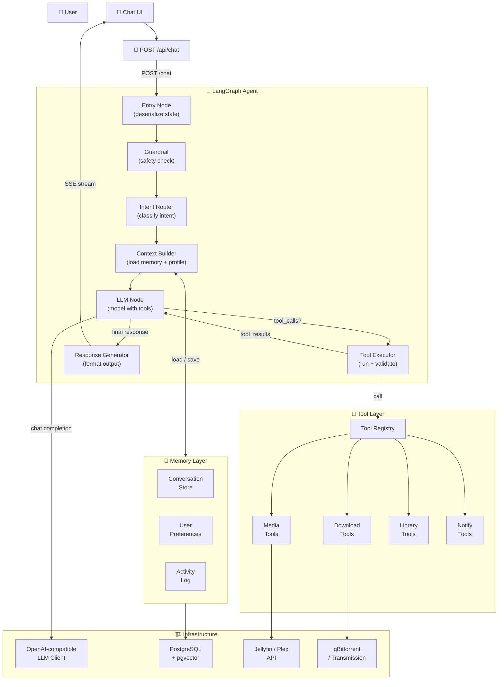

# 05 — NAS Agent 架构反向设计

> 基于 MoviePilot v2 源码分析，反向设计「NAS 私有媒体库智能管理系统」Agent 架构
> 目标：可直接落地的工程方案，能写进简历
> 技术栈：Python + LangGraph + Pydantic + FastAPI

---

## 1. 参考项目可借鉴设计

| 设计点 | 参考项目实现 | 为什么值得学 | 我项目中如何迁移 |
| ------ | ------------ | ------------ | ---------------- |
| **Agent 调用链路** | `MessageChain` → `AgentManager` → `MoviePilotAgent.process()` → `create_agent()` 内部 Agent Loop（`app/chain/message.py:1128` → `app/agent/__init__.py:1017`） | 异步队列隔离（`asyncio.Queue` per session）确保消息串行处理，不会并发冲突 | API 层收到消息 → 入队 → SessionWorker 串行消费 → 调用 LangGraph |
| **Context 构造** | `PromptManager.get_agent_prompt()` 组装 System Prompt，中间件逐层 `append_to_system_message()`（`app/agent/prompt/__init__.py:118`） | **累积式构造**：核心 Prompt → 渠道能力 → Persona → Memory → Skills → Jobs，每层独立追加，不相互耦合 | System Prompt 分层模板 → Context Builder 按需注入 → 合并后发给 LLM |
| **Memory 设计** | 五层金字塔：Summarization → Messages → ActivityLog → FileMemory → Persona/Skills（`app/agent/middleware/memory.py` + `activity_log.py`） | **递进式持久化**：越靠近 LLM 的越短（压缩消息），越远的越持久（文件记忆）；Agent 自行管理文件记忆是亮点 | 三层记忆：ConversationMessages（Redis/DB）→ ActivitySummary（DB）→ UserPreferences（DB），Agent 通过 `memory.update_preference` 工具自行写入偏好 |
| **Tool 系统** | `MoviePilotTool(BaseTool)` 基类 + Pydantic `args_schema` + `explanation` 必填字段 + `_arun()` 统一流水线（`app/agent/tools/base.py:114-203`） | 统一基类封装了权限→进度→执行→格式化的全套流水线；`explanation` 字段强制 LLM 解释调用意图，便于审计 | `NasBaseTool` 基类：`check_permission()` → `get_progress_message()` → `execute()` → `format_result()`，Python + Pydantic schema |
| **Agent Loop** | LangChain `create_agent()` 内部：LLM → tool_calls → execute → ToolMessage → LLM → ... 循环直到 LLM 不再调用工具 | 真正的 Agent Loop 应由框架管理（LangGraph StateGraph），业务代码只负责配置节点和路由 | LangGraph `StateGraph` + `tools_node` + `should_continue` 条件边，LLM ↔ Tool 交替直到 `__end__` |
| **多轮对话** | Session 24h TTL + `InMemorySaver` checkpoint + `MemoryManager` 缓存 messages 列表（`app/agent/memory/__init__.py:66`） | Session 管理 + 消息持久化 + TTL 清理，是生产级多轮对话的基础 | Session 管理（Redis/DB）+ LangGraph `MemorySaver`/`SqliteSaver` + 按 `conversation_id` 加载历史 messages |
| **工程化日志** | `logger.info(f"用户 {userid} 开始执行：{command}")` + `ActivityLogMiddleware` 自动 LLM 摘要（`app/agent/middleware/activity_log.py:377`） | 关键节点埋点 + LLM 自动摘要活动日志，既有结构化日志也有可读摘要 | 关键节点结构化日志（JSON）+ 每次对话结束自动生成一句话摘要存入 DB |
| **异常处理** | 工具异常不抛出，统一 `{success: false, error, error_type}` 格式返回给 LLM（`app/agent/tools/base.py:200-203`） | 异常返回而非抛出，让 LLM 有机会看到错误并自我纠正，不中断 Agent Loop | 所有工具异常统一 `ToolError` 格式返回，LLM 可据此重试或告知用户 |
| **工具预筛选** | `ToolSelectorMiddleware` 独立 LLM 调用筛工具（`app/agent/middleware/tool_selection.py:494`） | 70+ 工具全发给 LLM 会炸 context window，预筛选是必需优化 | MVP 阶段 8 个工具不需要预筛；工具 >20 时引入 `IntentRouter` 按 intent 分配工具子集 |
| **流式输出** | `StreamingHandler` + 0.3s flush + 消息编辑（`app/agent/callback/__init__.py:22`） | token 缓冲 + 定时 flush + 编辑已有消息，用户体验平滑，不刷屏 | SSE streaming + 前端增量渲染 + 0.3s 批量更新 |

---

## 2. 不建议照搬的设计

| 不建议照搬的点 | 参考项目中的表现 | 为什么不适合我 | 我的替代方案 |
| -------------- | ---------------- | -------------- | ------------ |
| **8 层中间件链** | `SkillsMiddleware` → `JobsMiddleware` → `RuntimeConfigMiddleware` → `MemoryMiddleware` → `ActivityLogMiddleware` → `SummarizationMiddleware` → `PatchToolCallsMiddleware` → `UsageMiddleware` → `ToolSelectorMiddleware`（`app/agent/__init__.py:566-607`） | 太重。MVP 不需要 Skills/Jobs/Persona 系统，8 层中间件对简历展示也是黑盒 | **3 层中间件**：MemoryContext → ToolPermission → UsageTracking。其余逻辑放入 LangGraph 节点 |
| **文件系统做长期记忆** | `config/agent/memory/*.md` 文件，Agent 通过 `write_file`/`edit_file` 工具自行管理（`app/agent/middleware/memory.py:276`） | 不可靠：依赖 LLM 正确调用文件工具；无结构，查询困难；并发不安全 | **结构化 DB 存储**：`user_preferences` 表（JSONB），Agent 通过 `memory.update_preference` 工具写入，有 schema 约束 |
| **LangChain 封装过深** | `create_agent()` 一行调用隐藏了 StateGraph 构建、tool binding、checkpoint 管理（`app/agent/__init__.py:609-615`） | 简历上展示时面试官问"LangGraph 节点怎么定义的？"你只能说"用了 create_agent()"，体现不出对 LangGraph 的理解 | **手写 LangGraph StateGraph**：显式定义 `nodes`、`edges`、`conditional_edges`、`checkpointer`，面试时能讲清楚每个节点的职责 |
| **70+ 工具一条龙注册** | `MoviePilotToolFactory.create_tools()` 一次性注册所有工具，再靠 `ToolSelectorMiddleware` 预筛选（`app/agent/tools/factory.py:137`） | MVP 阶段不需要 70 个工具；一次性注册 + 预筛选增加了一层 LLM 调用的延迟和成本 | **Intent-based 工具分配**：`IntentRouter` 识别 intent → 按 intent 分配工具子集（3-5 个），不需要额外 LLM 调用 |
| **`InMemorySaver` 进程内状态** | `checkpointer=InMemorySaver()`（`app/agent/__init__.py:614`），服务重启后所有对话状态丢失 | 不适合生产环境，也不利于简历展示（面试官会问 checkpoint 持久化方案） | **SqliteSaver**（MVP）+ **PostgresSaver**（生产）。checkpoint 持久化是 LangGraph 的核心卖点，必须展示 |
| **`asyncio.run_coroutine_threadsafe` 桥接** | 同步框架（FastAPI 线程）→ 异步 Agent 的线程桥接（`app/chain/message.py:1241`） | 脆弱：需要全局 `global_vars.loop`，线程安全难保证 | **全异步栈**：API（FastAPI async）→ Agent（async）→ Tools（async），不混用同步/异步 |
| **消息编辑式流式输出** | 先发一条消息，后续 token 通过编辑消息追加（`app/agent/callback/__init__.py:461`） | 依赖消息渠道的编辑能力（Telegram/WeChat 支持，Web 不一定） | **SSE + 前端增量渲染**：标准 HTTP SSE 协议，前端用 `text/event-stream` 消费，不依赖渠道能力 |
| **命令黑名单安全** | `COMMAND_FORBIDDEN_KEYWORDS` 基于关键字匹配（`app/agent/tools/impl/execute_command.py:32`） | 容易绕过（`rm -rf /` 被禁，但 `rm -rf /*` 可以过），安全性弱 | **白名单模式**：只允许预定义的 NAS 管理命令列表，所有其他命令拒绝执行 |
| **Plugin 动态工具注册** | `PluginManager().get_plugin_agent_tools()` 运行时加载（`app/agent/tools/factory.py:244`） | MVP 不需要插件系统，过度设计 | **静态 Tool Registry**：硬编码 8 个工具，后续按需手动添加 |

---

## 3. 我的 NAS Agent 总体架构



**核心设计决策：**

| 决策 | 选择 | 理由 |
|------|------|------|
| Agent 框架 | LangGraph（手写 StateGraph） | 面试能讲清楚每个节点；状态管理透明；支持子图扩展 |
| Model 调用 | OpenAI-compatible HTTP API（`openai` Python SDK） | MoviePilot 同款模式；直接控制 request/response；简历展示对 API 协议的理解 |
| Message 管理 | 自己构建 `BaseMessage` 列表，传给 LangGraph state | LangGraph 原生就用 messages 列表，参考 MoviePilot 的 `MemoryManager` 模式 |
| Checkpointer | MVP: `MemorySaver` → 生产: `PostgresSaver` | LangGraph 原生支持，一行切换 |
| 异步方案 | 全异步（FastAPI + asyncio） | 避免 MoviePilot 的 `run_coroutine_threadsafe` 线程桥接问题 |
| 流式输出 | SSE（Server-Sent Events） | 标准协议，前端原生支持，不依赖渠道 |
| 数据校验 | Pydantic v2 | MoviePilot 同款，Python 生态标准 |

---

## 4. 推荐目录结构

```text
nas-agent/
├── src/
│   ├── api/
│   │   ├── routes/
│   │   │   └── chat.py               # POST /api/chat, GET /api/chat/{conversation_id}/history
│   │   ├── middleware/
│   │   │   ├── auth.py               # 用户认证
│   │   │   └── rate_limit.py         # 速率限制
│   │   └── schemas/
│   │       └── chat.py               # Request/Response DTO (Pydantic)
│   │
│   ├── agent/
│   │   ├── graph.py                  # ★ LangGraph StateGraph 定义（nodes + edges + checkpointer）
│   │   ├── state.py                  # ★ NasAgentState (TypedDict + Annotated)
│   │   ├── nodes/
│   │   │   ├── guardrail.py          # 安全护栏节点
│   │   │   ├── intent_router.py      # ★ 意图分类节点
│   │   │   ├── context_builder.py    # ★ Context 组装节点
│   │   │   ├── llm_node.py           # LLM 调用节点（含 tool binding）
│   │   │   ├── tool_executor.py      # ★ Tool 执行节点
│   │   │   └── response_generator.py # 最终回复格式化
│   │   └── middleware/
│   │       ├── memory_context.py     # Memory 注入中间件
│   │       ├── tool_permission.py    # Tool 权限校验中间件
│   │       └── usage_tracking.py     # Token/Cost/Latency 追踪
│   │
│   ├── tools/
│   │   ├── registry.py               # ★ ToolRegistry: register + get_by_intent + execute
│   │   ├── base.py                   # ★ NasBaseTool 抽象基类
│   │   ├── types.py                  # ToolMeta, ToolResult, ToolContext (Pydantic)
│   │   ├── media/
│   │   │   ├── search_media.py       # media.search
│   │   │   └── get_media_detail.py   # media.get_detail
│   │   ├── download/
│   │   │   ├── create_task.py        # download.create_task
│   │   │   └── get_status.py         # download.get_status
│   │   ├── library/
│   │   │   └── scan_library.py       # library.scan
│   │   ├── subscription/
│   │   │   └── manage_subscription.py # subscription.manage
│   │   └── notification/
│   │       └── send_notification.py  # notification.send
│   │
│   ├── memory/
│   │   ├── memory_service.py         # ★ MemoryService: load/save/expire
│   │   ├── schemas.py                # ★ MemoryContext, UserProfile, ConversationContext (Pydantic)
│   │   └── activity_logger.py        # LLM 自动摘要 + 存储
│   │
│   ├── prompts/
│   │   ├── system_prompt.py          # ★ 分层 System Prompt 模板
│   │   ├── intent_prompts.py         # Intent 分类专用 Prompt
│   │   └── response_rules.py         # 回复风格/安全规则
│   │
│   ├── services/
│   │   ├── media_service.py          # TMDb API 封装
│   │   ├── download_service.py       # qBittorrent/Transmission API 封装
│   │   ├── library_service.py        # Jellyfin/Plex API 封装
│   │   └── notification_service.py   # 通知渠道封装
│   │
│   ├── infra/
│   │   ├── llm_client.py             # OpenAI-compatible HTTP Client
│   │   ├── logger.py                 # 结构化日志（JSON）
│   │   ├── trace.py                  # Agent Trace（每轮对话的完整链路记录）
│   │   └── config.py                 # 配置管理（环境变量 + YAML）
│   │
│   └── db/
│       ├── models.py                 # SQLAlchemy / SQLModel ORM 模型
│       ├── migrations/               # Alembic 数据库迁移文件
│       └── repository/
│           ├── conversation_repo.py  # 对话持久化
│           └── preference_repo.py    # 用户偏好持久化
│
├── tests/
│   ├── agent/
│   │   ├── test_graph.py             # LangGraph 图结构测试
│   │   ├── test_intent_router.py     # Intent 分类准确率测试
│   │   └── e2e/
│   │       └── test_search_download.py  # 端到端场景测试
│   ├── tools/
│   │   ├── test_search_media.py
│   │   ├── test_create_download.py
│   │   └── mock_tools.py             # Mock Tool 工厂
│   └── evals/
│       ├── golden_tests.py           # Golden Test 用例
│       ├── eval_runner.py            # Eval 运行器
│       └── cases/
│           ├── search_media.json
│           └── download_flow.json
│
├── config/
│   ├── agent.default.yaml            # Agent 默认配置
│   └── tools.yaml                    # Tool 白名单配置
│
├── pyproject.toml
├── docker-compose.yml                # PostgreSQL + pgvector + Redis
└── README.md
```

**分层职责说明：**

| 层级 | 职责 | 依赖方向 |
|------|------|----------|
| `api/` | HTTP 接口，请求校验，SSE 流式响应 | → `agent/` |
| `agent/` | LangGraph 图定义，节点逻辑，middleware | → `tools/`, `memory/`, `prompts/`, `infra/` |
| `tools/` | Tool 注册、基类、具体实现 | → `services/`, `infra/` |
| `memory/` | 对话记忆、用户偏好、活动日志 | → `db/`, `infra/` |
| `prompts/` | 纯文本模板，无外部依赖 | — |
| `services/` | 外部 API 封装（TMDb, qBittorrent, Jellyfin） | → `infra/` |
| `infra/` | LLM Client, Logger, Tracer, Config | — |
| `db/` | ORM Model, Repository | → `infra/` |

---

## 5. AgentState Schema

```python
# src/agent/state.py
"""
NAS Agent 的完整 State Schema。

LangGraph Python 中 State 使用 TypedDict + Annotated 定义。
参考 LangGraph 官方文档和 MoviePilot agent/__init__.py 的 StateGraph 用法。

设计原则：
1. messages 是 LangGraph 的核心字段，使用 add_messages reducer（官方标准）
2. 业务字段按生命周期分组：跨轮次保留 vs 单轮使用
3. error 有独立的生命周期，不污染正常流程
"""

from typing import Annotated, Any, Optional, TypedDict
from langgraph.graph.message import add_messages
from langchain_core.messages import BaseMessage


# ==================== 子类型 ====================

class IntentResult(TypedDict, total=False):
    """Intent 路由结果"""
    intent: str                        # e.g. "search_media", "download_media"
    confidence: float                  # 0.0 - 1.0
    entities: dict[str, str]           # e.g. {"title": "盗梦空间", "quality": "1080p"}
    needs_clarification: bool          # 是否需要追问用户


class MediaCandidate(TypedDict, total=False):
    """搜索结果候选项"""
    tmdb_id: int
    title: str
    year: str
    overview: str
    poster_url: Optional[str]
    rating: Optional[float]
    available_qualities: Optional[list[str]]


class ActiveTaskState(TypedDict, total=False):
    """当前活跃任务的状态"""
    task_type: str                     # "download" | "search" | "subscribe" | "library_scan"
    status: str                        # "collecting" | "confirming" | "executing" | "completed" | "failed"
    candidates: Optional[list[MediaCandidate]]
    selected_index: Optional[int]
    download_task_id: Optional[str]
    progress: Optional[str]            # 人类可读的进度描述


class PendingConfirmation(TypedDict, total=False):
    """需要用户确认的写操作"""
    tool_name: str
    summary: str                       # "即将创建下载任务：盗梦空间 (2010) 1080p"
    tool_input: dict[str, Any]         # 完整的 tool 参数
    confirm_message: str               # 展示给用户的确认问题
    expires_at: str                    # ISO timestamp, 5 分钟后超时


class ToolCallRecord(TypedDict):
    tool_name: str
    input: dict[str, Any]
    timestamp: str


class ToolResultRecord(TypedDict):
    tool_name: str
    success: bool
    data: Optional[Any]
    error: Optional[str]
    duration_ms: int


class AgentError(TypedDict, total=False):
    node: str                          # 出错节点名
    message: str
    type: str                          # "tool_error" | "llm_error" | "timeout" | "validation_error"
    recoverable: bool
    retry_count: Optional[int]


class RunMetadata(TypedDict, total=False):
    started_at: str
    node_timings: dict[str, float]     # node name → ms
    llm_calls: int
    tool_calls: int


class MemoryContext(TypedDict, total=False):
    """每轮注入给 LLM 的上下文占位（具体结构见第 6 节）"""
    user_profile: dict[str, Any]
    conversation: dict[str, Any]
    active_task_context: Optional[dict[str, Any]]
    recent_activity: dict[str, Any]


# ==================== 主 State ====================

class NasAgentState(TypedDict, total=False):
    """
    NAS Agent 的完整 State。

    字段上的 Annotated 定义了 reducer 行为：
    - add_messages: LangGraph 标准，追加消息而非覆盖
    - 无 Annotated: 默认覆盖式（后写入的值替换前值）
    """

    # --- 用户 & 会话标识（跨轮次） ---
    user_id: str
    conversation_id: str

    # --- 消息历史（跨轮次，LangGraph 核心字段） ---
    # add_messages reducer: 自动将新消息追加到列表，ToolMessage 按 tool_call_id 合并
    messages: Annotated[list[BaseMessage], add_messages]

    # --- 当前用户输入（单轮，覆盖式） ---
    current_input: str

    # --- Intent 路由结果（单轮，覆盖式） ---
    intent: Optional[IntentResult]

    # --- Memory 上下文（每轮刷新，覆盖式） ---
    memory_context: Optional[MemoryContext]

    # --- 当前任务状态（单轮或多轮，覆盖式） ---
    active_task: Optional[ActiveTaskState]

    # --- Tool 相关 ---
    available_tools: list[str]                    # 当前轮次可用的工具白名单
    tool_calls: Annotated[list[ToolCallRecord],   # 本轮已执行的 tool calls（追加式）
                          lambda prev, next: prev + next]
    tool_results: Annotated[list[ToolResultRecord],  # 本轮已收集的 tool results（追加式）
                            lambda prev, next: prev + next]

    # --- 用户确认（单轮，覆盖式） ---
    pending_confirmation: Optional[PendingConfirmation]

    # --- 最终响应（单轮，覆盖式） ---
    final_response: Optional[str]

    # --- 错误处理（单轮，覆盖式） ---
    error: Optional[AgentError]

    # --- 元数据（单轮，覆盖式） ---
    metadata: RunMetadata
```

**State 字段生命周期说明：**

| 字段 | 生命周期 | 初始值来源 | 何时清除 |
|------|----------|-----------|----------|
| `user_id` | 会话级 | API 请求 | 会话结束 |
| `conversation_id` | 会话级 | API 请求 / 新建 | 会话结束 |
| `messages` | 会话级（LangGraph checkpoint 持久化） | 从 DB 加载 | 用户手动清除 / TTL 过期 |
| `current_input` | 单轮 | API 请求 body | 每轮开始时覆盖 |
| `intent` | 单轮 | IntentRouter 节点输出 | 每轮开始时覆盖 |
| `memory_context` | 单轮（内容跨轮次持久化，但每轮重新加载） | MemoryService 加载 | 每轮开始时覆盖 |
| `active_task` | 单轮或多轮 | IntentRouter / ToolExecutor 设置 | 任务完成或超时后清除 |
| `available_tools` | 单轮 | IntentRouter 按 intent 筛选 | 每轮开始时覆盖 |
| `tool_calls` | 单轮 | ToolExecutor 追加 | 每轮开始时清空 |
| `tool_results` | 单轮 | ToolExecutor 追加 | 每轮开始时清空 |
| `pending_confirmation` | 单轮 | ToolExecutor（写操作触发） | 用户确认/取消后清除 |
| `final_response` | 单轮 | ResponseGenerator 输出 | 每轮开始时覆盖 |
| `error` | 单轮 | 任何节点 | 下一轮开始时清除（恢复后） |
| `metadata` | 单轮 | 每轮新建 | 每轮开始时覆盖 |

---

## 6. MemoryContext Schema

```python
# src/memory/schemas.py
"""
Memory 三层架构：

Layer 1 — ConversationMessages (短期)  → LangGraph checkpoint / messages 列表
Layer 2 — ActivitySummary   (中期)    → DB, 近 7 天, LLM 自动摘要
Layer 3 — UserPreferences   (长期)    → DB, 用户偏好, Agent 工具写入
"""

from __future__ import annotations
from datetime import datetime
from typing import Optional
from pydantic import BaseModel, Field


# ==================== Layer 1: ConversationMessages ====================
# 由 LangGraph 的 messages state + checkpointer 自动管理，不需要额外 schema


# ==================== Layer 2: ActivitySummary ====================

class ActivityRecord(BaseModel):
    """单条活动记录（每日一条摘要）"""
    id: str
    user_id: str
    date: str                                          # "2026-05-22"
    summary: str = Field(..., max_length=80)           # LLM 自动摘要, ≤ 80 字符
    intent: str
    tool_calls_count: int = 0
    tokens_used: int = 0
    created_at: str


# ==================== Layer 3: UserPreferences ====================

class DownloadPreferences(BaseModel):
    """下载偏好"""
    preferred_quality: str = "any"                     # "4K" | "1080p" | "720p" | "any"
    preferred_audio: str = "original"                  # "original" | "dubbed" | "any"
    preferred_subtitle: str = "zh"                     # "zh" | "en" | "zh-en" | "none"
    max_size_gb: Optional[float] = None
    download_path: Optional[str] = None


class MediaPreferences(BaseModel):
    """媒体偏好"""
    favorite_genres: list[str] = []                    # ["科幻", "悬疑", "动画"]
    excluded_genres: list[str] = []                    # ["恐怖"]
    favorite_directors: list[str] = []
    favorite_actors: list[str] = []
    preferred_languages: list[str] = ["zh"]            # ["zh", "en", "ja"]


class NotificationPreferences(BaseModel):
    """通知偏好"""
    enabled: bool = True
    channels: list[str] = []                           # ["telegram", "email"]
    events: list[str] = []                             # ["download_complete", "new_episode"]


class InteractionPreferences(BaseModel):
    """交互偏好"""
    response_style: str = "concise"                    # "concise" | "detailed"
    auto_confirm_downloads: bool = False
    preferred_view: str = "list"                       # "list" | "poster"


class UserPreferences(BaseModel):
    """完整的用户偏好（DB 存储）"""
    user_id: str
    download: DownloadPreferences = Field(default_factory=DownloadPreferences)
    media: MediaPreferences = Field(default_factory=MediaPreferences)
    notification: NotificationPreferences = Field(default_factory=NotificationPreferences)
    interaction: InteractionPreferences = Field(default_factory=InteractionPreferences)
    updated_at: str = ""


# ==================== MemoryContext: 每轮注入给 LLM 的上下文 ====================

class UserProfileSummary(BaseModel):
    """
    用户档案摘要

    生命周期：跨会话持久化
    更新方式：Agent 通过 memory.update_preference 工具写入 DB，
              下一轮 ContextBuilder 重新加载
    """
    preferred_quality: str = "any"
    favorite_genres: list[str] = []
    response_style: str = "concise"
    auto_confirm_downloads: bool = False


class ConversationContext(BaseModel):
    """
    对话上下文

    生命周期：单次会话内
    内容：不直接注入最近消息原文（messages 已由 LangGraph 管理），
          而是注入对话阶段的摘要
    """
    session_start_time: str = ""
    turn_count: int = 0                                # 当前会话已进行的轮数
    last_intent: Optional[str] = None                  # 上一轮的 intent
    last_search_results_summary: Optional[str] = None  # 上一轮搜索结果摘要
    pending_topics: list[str] = []                     # 尚未完成的讨论主题


class ActiveTaskContext(BaseModel):
    """
    活跃任务上下文

    生命周期：任务创建 → 任务完成/取消
    作用：让 Agent 在新消息到来时记得"当前正在做什么"
    """
    task_type: str = ""
    description: str = ""                              # "正在下载 盗梦空间 (2010) 1080p"
    status: str = "collecting"                         # "confirming" | "downloading" | "scanning"
    progress: Optional[str] = None                     # "下载中 45.2% (2.3GB / 5.1GB)"
    candidates: Optional[list[dict]] = None
    selected_index: Optional[int] = None


class RecentActivityContext(BaseModel):
    """
    最近活动上下文

    生命周期：最近 7 天，每天一条摘要
    作用：让 Agent 了解用户最近的媒体消费/下载行为
    """
    activities: list[ActivityRecord] = []
    summary: str = ""                                  # "最近一周下载了 3 部电影，主要是科幻类型"


class MemoryContext(BaseModel):
    """每轮注入给 LLM 的完整记忆上下文"""
    user_profile: UserProfileSummary = Field(default_factory=UserProfileSummary)
    conversation: ConversationContext = Field(default_factory=ConversationContext)
    active_task_context: Optional[ActiveTaskContext] = None
    recent_activity: RecentActivityContext = Field(default_factory=RecentActivityContext)
```

**Memory 生命周期全景：**

```
┌──────────────────────────────────────────────────────────────┐
│                    Memory 生命周期                            │
│                                                              │
│  UserPreferences (长期)                                      │
│  ├─ 生命周期: 跨会话，永久保存                                │
│  ├─ 更新: Agent 通过 memory.update_preference 工具写入        │
│  └─ 读取: 每轮 ContextBuilder 加载 → user_profile 摘要        │
│                                                              │
│  ActivityRecord (中期)                                        │
│  ├─ 生命周期: 保留 7 天                                       │
│  ├─ 更新: 每轮对话结束后 LLM 自动生成一句话摘要                │
│  └─ 读取: 每轮 ContextBuilder 加载 → recent_activity          │
│                                                              │
│  ConversationMessages (短期)                                  │
│  ├─ 生命周期: 单次会话 (conversation_id)                      │
│  ├─ 更新: 每轮 LLM 返回的 AIMessage + ToolMessage              │
│  └─ 读取: LangGraph checkpointer 自动加载 → messages 列表     │
│                                                              │
│  ActiveTaskContext (临时)                                     │
│  ├─ 生命周期: 任务创建 → 完成/取消                             │
│  ├─ 更新: ToolExecutor 执行后设置                             │
│  └─ 读取: 每轮 ContextBuilder 检查 → active_task_context      │
└──────────────────────────────────────────────────────────────┘
```

---

## 7. Tool Registry 设计

### 7.1 Tool 总表

| Tool Name | 类型 | 作用 | 需要确认 | 适用 Intent | require_admin |
|-----------|------|------|----------|-------------|---------------|
| `media.search` | read | 搜索影视资源（TMDb） | 否 | `search_media` | 否 |
| `media.get_detail` | read | 获取单个影视详情（演员、季集、评分） | 否 | `search_media`, `recommend` | 否 |
| `media.recommend` | read | 基于偏好/热门推荐影视 | 否 | `recommend` | 否 |
| `download.create_task` | write | 创建下载任务 | **是** | `download_media` | 是 |
| `download.get_status` | read | 查询下载进度 | 否 | `check_download` | 否 |
| `download.cancel` | write | 取消下载任务 | **是** | `check_download` | 是 |
| `subscription.manage` | write | 创建/查看/取消剧集订阅 | **是**（创建/取消时） | `subscribe_series` | 否 |
| `library.scan` | write | 触发媒体库扫描 | **是** | `scan_library` | 是 |
| `library.browse` | read | 浏览媒体库文件/目录 | 否 | `scan_library`, `browse_library` | 否 |
| `metadata.update` | write | 修改媒体元数据（标题、年份、海报） | **是** | `update_metadata` | 是 |
| `system.status` | read | 查询 NAS 系统状态（CPU/内存/磁盘） | 否 | `system_status` | 否 |
| `memory.update_preference` | write | 更新用户偏好（画质、类型、通知） | 否 | `update_preference` | 否 |

### 7.2 Tool 基础类型定义

```python
# src/tools/types.py
from __future__ import annotations
from abc import ABC, abstractmethod
from typing import Any, Optional, Literal
from pydantic import BaseModel, Field

from src.memory.schemas import UserProfileSummary


# ==================== 枚举与字面量 ====================

ToolCategory = Literal[
    "media", "download", "library", "subscription",
    "notification", "system", "memory"
]
RiskLevel = Literal["read", "write", "admin"]
ToolErrorType = Literal[
    "validation_error", "service_error", "timeout",
    "permission_denied", "not_found",
    "confirmation_required", "confirmation_expired"
]


# ==================== 结构体 ====================

class ToolMeta(BaseModel):
    """每个 Tool 的标准元数据"""
    name: str
    description: str                    # 给 LLM 看的功能描述
    category: ToolCategory
    risk_level: RiskLevel
    requires_confirmation: bool = False
    requires_admin: bool = False
    intent_whitelist: list[str] = []    # 仅在特定 intent 下可用
    max_result_chars: int = 64 * 1024   # 结果截断长度
    progress_message: str = ""          # 执行中的进度提示模板


class ToolResult(BaseModel):
    """Tool 执行统一返回"""
    success: bool
    data: Optional[Any] = None
    error: Optional[str] = None
    error_type: Optional[ToolErrorType] = None
    truncated: bool = False
    truncated_length: Optional[int] = None


class ToolContext(BaseModel):
    """Tool 执行上下文"""
    user_id: str
    conversation_id: str
    is_admin: bool
    user_preferences: UserProfileSummary
    trace_id: str
```

### 7.3 Tool 基类实现

```python
# src/tools/base.py
import json
import time
from abc import ABC, abstractmethod
from typing import Any
from pydantic import BaseModel, ValidationError

from src.tools.types import ToolMeta, ToolResult, ToolContext
from src.infra.logger import get_logger

logger = get_logger(__name__)


class NasBaseTool(ABC):
    """
    NAS Agent 工具抽象基类。

    参考 MoviePilot 的 MoviePilotTool(BaseTool) 设计（app/agent/tools/base.py:114），
    统一封装：权限检查 → 输入校验 → 执行 → 结果格式化 → 截断。

    子类只需：
    1. 定义 meta: ToolMeta
    2. 定义 InputSchema: BaseModel
    3. 实现 execute_impl()
    """

    @property
    @abstractmethod
    def meta(self) -> ToolMeta:
        """工具元数据"""
        ...

    @property
    @abstractmethod
    def input_schema(self) -> type[BaseModel]:
        """Pydantic 输入校验模型"""
        ...

    @abstractmethod
    async def execute_impl(self, input: BaseModel, ctx: ToolContext) -> Any:
        """子类实现具体业务逻辑，返回可 JSON 序列化的数据"""
        ...

    # ========== 公共入口 ==========

    async def execute(self, raw_input: dict[str, Any], ctx: ToolContext) -> ToolResult:
        """公共入口：权限 → 校验 → 执行 → 格式化 → 截断"""
        trace_label = f"tool:{self.meta.name}:{ctx.trace_id}"
        start = time.monotonic()

        try:
            # 1. 校验输入（Pydantic）
            try:
                validated = self.input_schema.model_validate(raw_input)
            except ValidationError as e:
                logger.warning(f"[{trace_label}] validation error", extra={
                    "errors": [{"path": ".".join(map(str, err["loc"])), "msg": err["msg"]}
                               for err in e.errors()]
                })
                return ToolResult(
                    success=False,
                    error=f"输入参数校验失败: {e}",
                    error_type="validation_error",
                )

            # 2. 权限检查
            if self.meta.requires_admin and not ctx.is_admin:
                return ToolResult(
                    success=False,
                    error="此操作需要管理员权限",
                    error_type="permission_denied",
                )

            # 3. 执行
            logger.info(f"[{trace_label}] executing", extra={"input": raw_input})
            data = await self.execute_impl(validated, ctx)
            duration_ms = int((time.monotonic() - start) * 1000)

            # 4. 格式化 + 截断
            serialized = json.dumps(data, ensure_ascii=False, indent=2, default=str)
            max_chars = self.meta.max_result_chars
            if len(serialized) > max_chars:
                serialized = serialized[:max_chars] + \
                    f"\n...(truncated at {max_chars} chars)"
                truncated = True
            else:
                truncated = False

            logger.info(f"[{trace_label}] completed in {duration_ms}ms")
            return ToolResult(
                success=True,
                data=serialized,
                truncated=truncated,
                truncated_length=len(serialized) if truncated else None,
            )

        except Exception as e:
            logger.error(f"[{trace_label}] unexpected error", exc_info=True)
            return ToolResult(
                success=False,
                error=str(e),
                error_type="service_error",
            )

    # ========== 辅助方法 ==========

    def get_progress_message(self, raw_input: dict[str, Any]) -> str:
        """生成执行中的进度提示文本"""
        if self.meta.progress_message:
            return self.meta.progress_message
        try:
            validated = self.input_schema.model_validate(raw_input)
            # 子类可覆写 _build_progress_message 做更友好的提示
            return self._build_progress_message(validated)
        except Exception:
            return f"正在执行 {self.meta.name}..."

    def _build_progress_message(self, _input: BaseModel) -> str:
        """子类可覆写此方法生成友好进度提示"""
        return f"正在执行 {self.meta.name}..."
```

### 7.4 Tool 实现示例

```python
# src/tools/media/search_media.py
from typing import Optional, Literal
from pydantic import BaseModel, Field

from src.tools.base import NasBaseTool
from src.tools.types import ToolMeta, ToolContext


class SearchMediaInput(BaseModel):
    """media.search 的输入 schema"""
    explanation: str = Field(
        ...,
        description="为什么需要搜索这部影视（用于审计追溯）"
    )
    query: str = Field(
        ...,
        description="搜索关键词：影视名称、演员名、导演名"
    )
    media_type: Optional[Literal["movie", "tv"]] = Field(
        None,
        description="按类型筛选，留空则搜索全部"
    )
    year: Optional[int] = Field(
        None,
        ge=1900,
        le=2100,
        description="发行年份，用于精确匹配"
    )
    limit: int = Field(
        default=10,
        ge=1,
        le=50,
        description="最多返回条数"
    )


class SearchMediaTool(NasBaseTool):
    """搜索 TMDb 影视资源 — 只读工具"""

    @property
    def meta(self) -> ToolMeta:
        return ToolMeta(
            name="media.search",
            description=(
                "Search the NAS media library via TMDb for movies or TV shows. "
                "Returns matching titles with TMDB IDs, years, ratings, and poster URLs. "
                "Use when the user asks to find a specific movie/show, "
                "or browse what's available by genre/keyword."
            ),
            category="media",
            risk_level="read",
            intent_whitelist=["search_media", "recommend", "download_media"],
            progress_message="正在搜索影视资源...",
        )

    @property
    def input_schema(self) -> type[BaseModel]:
        return SearchMediaInput

    async def execute_impl(self, input: SearchMediaInput, ctx: ToolContext) -> dict:
        """调用 TMDb API 搜索"""
        # 实际项目中使用 httpx 或 aiohttp 调 TMDb API
        # results = await tmdb_service.search(
        #     query=input.query,
        #     media_type=input.media_type,
        #     year=input.year,
        # )
        ...
        return {
            "count": 0,
            "results": [],
        }

    def _build_progress_message(self, input: SearchMediaInput) -> str:
        return f"正在搜索「{input.query}」..."


# src/tools/download/create_task.py
class CreateDownloadInput(BaseModel):
    """download.create_task 的输入 schema"""
    explanation: str = Field(
        ...,
        description="为什么创建此下载任务"
    )
    tmdb_id: int = Field(..., description="TMDb ID")
    media_type: Literal["movie", "tv"] = Field(..., description="媒体类型")
    quality: str = Field(default="1080p", description="目标清晰度")
    season: Optional[int] = Field(None, description="季号（电视剧必填）")


class CreateDownloadTaskTool(NasBaseTool):
    """创建下载任务 — 写操作，需管理员 + 用户确认"""

    @property
    def meta(self) -> ToolMeta:
        return ToolMeta(
            name="download.create_task",
            description=(
                "Create a new download task in the NAS downloader (qBittorrent/Transmission). "
                "Requires admin access and user confirmation. "
                "[IMPORTANT: This tool requires user confirmation before execution]"
            ),
            category="download",
            risk_level="write",
            requires_confirmation=True,
            requires_admin=True,
            intent_whitelist=["download_media"],
            progress_message="正在搜索下载资源并创建任务...",
        )

    @property
    def input_schema(self) -> type[BaseModel]:
        return CreateDownloadInput

    async def execute_impl(self, input: CreateDownloadInput, ctx: ToolContext) -> dict:
        """调用下载器 API 创建任务"""
        ...
        return {"task_id": "...", "status": "downloading"}
```

### 7.5 ToolRegistry

```python
# src/tools/registry.py
import json
from typing import Any

from src.tools.base import NasBaseTool
from src.tools.types import ToolResult, ToolContext


class ToolRegistry:
    """
    工具注册中心（全局单例）。

    参考 MoviePilot 的 MoviePilotToolFactory（app/agent/tools/factory.py:137），
    但简化为静态注册 + Intent-based 白名单筛选。
    """

    def __init__(self):
        self._tools: dict[str, NasBaseTool] = {}

    def register(self, tool: NasBaseTool) -> None:
        """注册单个工具"""
        name = tool.meta.name
        if name in self._tools:
            raise ValueError(f"Tool '{name}' already registered")
        self._tools[name] = tool

    def register_all(self, tools: list[NasBaseTool]) -> None:
        """批量注册"""
        for tool in tools:
            self.register(tool)

    # ========== 查询 ==========

    def get(self, name: str) -> NasBaseTool | None:
        """按名称获取工具"""
        return self._tools.get(name)

    def get_all(self) -> list[NasBaseTool]:
        """获取所有工具"""
        return list(self._tools.values())

    def get_by_intent(self, intent: str) -> list[NasBaseTool]:
        """按 intent 获取可用工具列表（白名单筛选）"""
        return [
            tool for tool in self._tools.values()
            if intent in tool.meta.intent_whitelist
        ]

    # ========== LLM 集成 ==========

    def get_tool_definitions_for_llm(self, intent: str) -> list[dict[str, Any]]:
        """
        按 intent 获取工具定义，转为 OpenAI function calling 格式。

        Returns: List of {"type": "function", "function": {"name": ..., "description": ..., "parameters": ...}}
        """
        definitions = []
        for tool in self.get_by_intent(intent):
            # 将 Pydantic model 的 JSON Schema 作为 parameters
            json_schema = tool.input_schema.model_json_schema()

            description = tool.meta.description
            if tool.meta.requires_confirmation:
                description += (
                    "\n\n⚠️ IMPORTANT: This tool requires user confirmation before "
                    "execution. The system will pause and ask the user to confirm. "
                    "Do NOT call this tool multiple times for the same action."
                )

            definitions.append({
                "type": "function",
                "function": {
                    "name": tool.meta.name,
                    "description": description,
                    "parameters": json_schema,
                }
            })
        return definitions

    # ========== 执行 ==========

    async def execute(self, name: str, input: dict[str, Any], ctx: ToolContext) -> ToolResult:
        """按名称执行工具"""
        tool = self._tools.get(name)
        if not tool:
            return ToolResult(
                success=False,
                error=f"未知工具: {name}",
                error_type="validation_error",
            )
        return await tool.execute(input, ctx)

    def requires_confirmation(self, name: str) -> bool:
        """判断工具是否需要用户确认"""
        tool = self._tools.get(name)
        return tool.meta.requires_confirmation if tool else False


# 全局单例
tool_registry = ToolRegistry()
```

### 7.6 Intent ↔ Tool 映射表

```python
# 在注册工具时，每个工具声明自己的 intent_whitelist
# 这个映射表在 IntentRouter 和 ToolRegistry 之间建立关联

INTENT_TOOL_MAP: dict[str, list[str]] = {
    "search_media":       ["media.search", "media.get_detail"],
    "recommend":          ["media.recommend", "media.get_detail"],
    "download_media":     ["media.search", "media.get_detail", "download.create_task"],
    "check_download":     ["download.get_status", "download.cancel"],
    "subscribe_series":   ["media.search", "subscription.manage"],
    "scan_library":       ["library.scan", "library.browse"],
    "browse_library":     ["library.browse", "media.get_detail"],
    "update_metadata":    ["media.get_detail", "metadata.update"],
    "system_status":      ["system.status"],
    "update_preference":  ["memory.update_preference"],
    "general_chat":       [],  # 闲聊，不需要工具
}
```

### 7.7 写入工具确认机制

```
流程：
1. LLM 发起 tool_call（如 download.create_task）
2. ToolExecutor 检查 tool.meta.requires_confirmation
3. 如果为 True → 暂停执行，设置 state.pending_confirmation
4. ResponseGenerator 向用户展示确认信息
5. 用户回复 "确认" / "取消"
6. IntentRouter 识别为 "confirm_action" / "cancel_action"
7. ToolExecutor 继续执行 or 放弃
```

```python
# PendingConfirmation 结构（已在 state 中定义，这里展示关键字段）
# {
#     "tool_name": "download.create_task",
#     "summary": "即将创建下载任务：盗梦空间 (2010) 1080p",
#     "tool_input": {"tmdb_id": 27205, "quality": "1080p", ...},
#     "confirm_message": "是否确认创建此下载任务？",
#     "expires_at": "2026-05-22T15:30:00Z",  # 5 分钟后超时
# }
```

### 7.8 错误结构

所有 Tool 返回统一的 `ToolResult`，错误按类型分类：

```
ToolErrorType:
  - validation_error      输入参数校验失败（Pydantic schema 不匹配）
  - service_error         外部服务异常（TMDb API down, qBittorrent 无响应）
  - timeout               执行超时
  - permission_denied     用户无权限
  - not_found             资源不存在
  - confirmation_required 需要用户确认（特殊：不是错误，是暂停信号）
  - confirmation_expired  确认超时

LLM 根据 error_type 决定策略：
  - validation_error      → 修正参数后重试
  - service_error         → 告知用户服务暂时不可用
  - timeout               → 提醒用户稍后重试
  - permission_denied     → 告知用户无权限
  - not_found             → 建议换关键词重新搜索
  - confirmation_required → 展示确认信息给用户
```

---

## 8. LangGraph 子图设计

### 8.1 MVP 阶段：单图 + 节点分工

```
┌─────────────────────────────────────────────────────┐
│                  nas_agent_graph                     │
│                                                     │
│  Entry ──→ Guardrail ──→ IntentRouter               │
│                               │                     │
│                               ▼                     │
│                         ContextBuilder               │
│                               │                     │
│                               ▼                     │
│                            LLMNode ◄──────────┐     │
│                               │                │     │
│                         ┌─────┴─────┐          │     │
│                         │ should    │  tool    │     │
│                         │ continue? │  results  │     │
│                         └─────┬─────┘          │     │
│                   final       │ tool_calls     │     │
│                   response    │                │     │
│                     │         ▼                │     │
│                     │     ToolExecutor ────────┘     │
│                     │         │                      │
│                     │    ┌────┴────┐                 │
│                     │    │ confirm  │                │
│                     │    │ required?│                │
│                     │    └────┬────┘                 │
│                     │    yes  │  no                  │
│                     │         │                      │
│                     ▼         ▼                      │
│               ResponseGen   直接执行                  │
│                     │                                │
│                     ▼                                │
│                   END                                │
└─────────────────────────────────────────────────────┘
```

**MVP 阶段不需要子图。** 6 个节点 + 1 个条件边足以覆盖所有场景。

### 8.2 Graph 构建代码（Python LangGraph）

```python
# src/agent/graph.py
from langgraph.graph import StateGraph, END
from langgraph.checkpoint.postgres import PostgresSaver

from src.agent.state import NasAgentState
from src.agent.nodes.guardrail import guardrail_node
from src.agent.nodes.intent_router import intent_router_node
from src.agent.nodes.context_builder import context_builder_node
from src.agent.nodes.llm_node import llm_node
from src.agent.nodes.tool_executor import tool_executor_node
from src.agent.nodes.response_generator import response_generator_node


def should_continue(state: NasAgentState) -> str:
    """条件边：检查最后一条 AIMessage 是否有 tool_calls"""
    from langchain_core.messages import AIMessage
    last_message = state["messages"][-1] if state.get("messages") else None
    if isinstance(last_message, AIMessage) and last_message.tool_calls:
        return "tool_executor"
    return "response_generator"


def build_graph(checkpointer=None) -> StateGraph:
    """构建 NAS Agent 主图"""
    workflow = StateGraph(NasAgentState)

    # 添加节点
    workflow.add_node("guardrail", guardrail_node)
    workflow.add_node("intent_router", intent_router_node)
    workflow.add_node("context_builder", context_builder_node)
    workflow.add_node("llm_node", llm_node)
    workflow.add_node("tool_executor", tool_executor_node)
    workflow.add_node("response_generator", response_generator_node)

    # 设置入口
    workflow.set_entry_point("guardrail")

    # 添加边
    workflow.add_edge("guardrail", "intent_router")
    workflow.add_edge("intent_router", "context_builder")
    workflow.add_edge("context_builder", "llm_node")

    # 条件边：LLM 节点 → tool_executor 或 response_generator
    workflow.add_conditional_edges(
        "llm_node",
        should_continue,
        {
            "tool_executor": "tool_executor",
            "response_generator": "response_generator",
        }
    )

    # tool_executor 执行后回到 llm_node（Agent Loop）
    workflow.add_edge("tool_executor", "llm_node")

    # 最终输出
    workflow.add_edge("response_generator", END)

    # 编译
    return workflow.compile(checkpointer=checkpointer)
```

### 8.3 进阶阶段：子图拆分

当工具数量超过 15 个、单次对话涉及多个独立子任务时，拆分子图：

| 子图 | 职责 | 输入 | 输出 | 可用工具 |
|------|------|------|------|----------|
| `search_download_subgraph` | 搜索 + 下载的完整闭环：搜索→展示候选→用户选择→创建下载 | `{query, quality, season?}` | `{task_id, status}` | `media.search`, `media.get_detail`, `download.create_task` |
| `subscription_subgraph` | 订阅管理：搜索剧集→选择→创建/查看/取消订阅 | `{action, tmdb_id?}` | `{subscriptions, status}` | `media.search`, `media.get_detail`, `subscription.manage` |
| `library_management_subgraph` | 媒体库操作：扫描→浏览→整理→元数据更新 | `{action, path?}` | `{scan_result, files}` | `library.scan`, `library.browse`, `metadata.update` |
| `recommendation_subgraph` | 推荐：分析偏好→获取热门→个性化推荐 | `{type: "personalized"\|"popular"\|"similar"}` | `{recommendations[]}` | `media.recommend`, `media.get_detail` |

子图切换方式：

```python
# src/agent/graph_advanced.py
from langgraph.graph import StateGraph

from src.agent.graph_advanced import (
    search_download_subgraph,
    subscription_subgraph,
    library_management_subgraph,
    recommendation_subgraph,
)


def route_by_intent(state: NasAgentState) -> str:
    """按 intent 路由到对应子图"""
    intent = state.get("intent", {}).get("intent", "general_chat")

    if intent in ("search_media", "download_media"):
        return "search_download"
    elif intent == "subscribe_series":
        return "subscription"
    elif intent in ("scan_library", "update_metadata"):
        return "library_management"
    elif intent == "recommend":
        return "recommendation"
    else:
        return "general_chat"


# 主图
main_graph = StateGraph(NasAgentState)

main_graph.add_node("entry", entry_node)
main_graph.add_node("guardrail", guardrail_node)
main_graph.add_node("intent_router", intent_router_node)
main_graph.add_node("context_builder", context_builder_node)

# 子图作为节点（已编译的子图）
main_graph.add_node("search_download", search_download_subgraph)
main_graph.add_node("subscription", subscription_subgraph)
main_graph.add_node("library_management", library_management_subgraph)
main_graph.add_node("recommendation", recommendation_subgraph)
main_graph.add_node("general_chat", general_chat_node)

main_graph.add_node("response_generator", response_generator_node)

main_graph.add_conditional_edges("intent_router", route_by_intent, {
    "search_download": "search_download",
    "subscription": "subscription",
    "library_management": "library_management",
    "recommendation": "recommendation",
    "general_chat": "general_chat",
})

main_graph.add_edge("search_download", "response_generator")
main_graph.add_edge("subscription", "response_generator")
# ...

compiled = main_graph.compile(checkpointer=PostgresSaver.from_conn_string(DB_URL))
```

---

## 9. 搜索并下载流程设计

### 场景：用户搜索科幻片 → 选择下载

```
用户：帮我找一下最近上映的科幻片
Agent：找到 3 部，你想下载哪一部？
用户：第二部下载 1080p 就行
用户：算了，换成 4K
用户：下载完通知我
```

### 逐轮状态变化表

| 轮次 | 用户输入 | Intent | confidence | State 变化 | 可用 Tools | 写操作确认 | 回复策略 |
|------|---------|--------|------------|-----------|-----------|-----------|----------|
| R1 | "帮我找一下最近上映的科幻片" | `search_media` | 0.92 | `intent={search_media, entities:{genre:"科幻"}}`; `active_task={type:"search", status:"collecting"}` | `media.search`, `media.get_detail` | — | 展示 3 个候选 + "你想下载哪一部？" |
| R2a | "第二部下载 1080p 就行" | `download_media` | 0.88 | `active_task.status="confirming"`; `active_task.selected_index=1`; `pending_confirmation={tool:"download.create_task", summary:"..."}` | `download.create_task` | **是** | "确认创建下载任务：第2部 1080p？" |
| R2b | "算了，换成 4K" | `modify_request` | 0.85 | `active_task.candidates[1].quality="4K"`; `pending_confirmation.summary` 更新为 4K | `download.create_task` | **是**（重新确认） | "已更新为 4K，确认创建下载任务？" |
| R2c | "下载完通知我" | `confirm_action` + `set_notification` | 0.90 | `pending_confirmation` 清除；`download.create_task` 执行；`memory_context.user_profile.notification.events` 追加 `download_complete` | `download.create_task`, `memory.update_preference` | 否（R2a已确认） | "下载任务已创建！下载完成后会通知你" |

### 详细流程（R1 → R2）

```
【R1】用户: "帮我找一下最近上映的科幻片"

Entry Node
  → state.current_input = "帮我找一下最近上映的科幻片"
  → state.user_id = "user_001"
  → state.conversation_id = "conv_abc123"

Guardrail Node
  → 检查 input 是否包含敏感内容 → pass

IntentRouter Node
  → 调用 LLM (system prompt = intent_prompts)
  → LLM 返回:
    {
      "intent": "search_media",
      "confidence": 0.92,
      "entities": {"genre": "科幻", "timeframe": "recent"},
      "needs_clarification": false
    }
  → state.intent = {"intent": "search_media", ...}
  → state.available_tools = ["media.search", "media.get_detail"]

ContextBuilder Node
  → memory_service.load("user_001")
    → user_profile: {"preferred_quality": "1080p", "favorite_genres": ["科幻", "悬疑"]}
    → recent_activity: "最近一周下载了《星际穿越》《信条》"
    → active_task_context: None (没有未完成任务)
  → 构造 System Prompt（含 user_profile + recent_activity）
  → state.memory_context = {user_profile, conversation, recent_activity}

LLM Node (第 1 次调用)
  → system_prompt + messages + tools=["media.search", "media.get_detail"]
  → LLM 返回: AIMessage with tool_calls=[
      {"name": "media.search", "args": {"query": "科幻 2025 2026", "media_type": "movie", "limit": 10}}
    ]

ToolExecutor Node
  → 执行 media.search(query="科幻 2025 2026", media_type="movie")
  → TMDb API 返回 15 部电影
  → format_result → 取 top 3 返回给 LLM（截断）
  → state.tool_calls.append({"tool_name": "media.search", ...})
  → state.tool_results.append({"tool_name": "media.search", "success": True, ...})
  → state.active_task.candidates = [3 部电影的简化数据]

LLM Node (第 2 次调用: Agent Loop 第二轮)
  → LLM 看到 ToolMessage (3 部电影)
  → 决定不需要再调用工具
  → 生成最终回复

ResponseGenerator Node
  → 格式化为用户友好的消息:
    "找到以下 3 部科幻电影:
     1. 星际穿越 2 (2025) ⭐8.5
     2. 沙丘 3 (2026) ⭐8.2
     3. 流浪地球 3 (2026) ⭐7.9
     你想下载哪一部？"
  → state.final_response = "..."

SSE Stream → 用户收到回复


【R2a】用户: "第二部下载 1080p 就行"

Entry Node
  → state.current_input = "第二部下载 1080p 就行"
  → 从 checkpoint 恢复 state: active_task 仍保留 R1 的 candidates

IntentRouter Node
  → LLM 返回: {"intent": "download_media", "confidence": 0.88,
                 "entities": {"index": "2", "quality": "1080p"}}
  → state.available_tools = ["download.create_task"]

ContextBuilder Node
  → 加载 memory: active_task_context 存在（R1 的搜索状态）
  → 注入到 System Prompt: "上一次搜索结果为《沙丘3》等3部电影，用户选择了第2部"

LLM Node
  → LLM 看到 active_task.candidates
  → 解析 "第二部" = candidates[1] = 《沙丘3》(2026)
  → 发起 tool_call: download.create_task(
      {"tmdb_id": 693134, "quality": "1080p", "media_type": "movie"}
    )

ToolExecutor Node
  → 检查 tool.meta.requires_confirmation → True
  → **暂停执行**，设置 state.pending_confirmation = {
      "tool_name": "download.create_task",
      "summary": "创建下载任务：沙丘 3 (2026) 1080p",
      "tool_input": {"tmdb_id": 693134, "quality": "1080p", ...},
      "confirm_message": "是否确认创建此下载任务？",
      "expires_at": "2026-05-22T15:30:00Z"
    }

ResponseGenerator Node
  → 检测到 pending_confirmation
  → 输出: "即将创建下载任务：**沙丘 3 (2026) 1080p**，是否确认？"


【R2b】用户: "算了，换成 4K"

IntentRouter Node
  → LLM 返回: {"intent": "modify_request", "entities": {"quality": "4K"}}

ContextBuilder Node
  → 加载 pending_confirmation
  → 注入: "用户之前请求下载《沙丘3》1080p，现在想改为 4K"

LLM Node
  → 更新 pending_confirmation.tool_input.quality = "4K"
  → 更新 pending_confirmation.summary

ResponseGenerator Node
  → "已更新为 4K。即将创建下载任务：**沙丘 3 (2026) 4K**，是否确认？"


【R2c】用户: "下载完通知我"

IntentRouter Node
  → LLM 返回: {"intent": "confirm_action", "entities": {"add_notification": True}}

ContextBuilder Node
  → 加载 pending_confirmation（4K 版本）
  → 注入到 System Prompt: "用户确认了之前的下载确认请求，并希望添加下载完成通知"

LLM Node
  → 发起 2 个 tool_calls:
    1. download.create_task({"tmdb_id": 693134, "quality": "4K"})
    2. memory.update_preference({"notification": {"events": ["download_complete"]}})

ToolExecutor Node
  → download.create_task: 不暂停（pending_confirmation 已匹配，视为已确认）
  → 执行: qbittorrent.add_torrent(...) → task_id "dl_xyz789"
  → memory.update_preference: 更新 DB
  → state.pending_confirmation = None  # 清除
  → state.active_task.status = "completed"

ResponseGenerator Node
  → "下载任务已创建！**沙丘 3 (2026) 4K** 已加入下载队列。
     下载完成后会通过通知提醒你。"
```

---

## 10. Prompt / Context 构造策略

### 10.1 Prompt 分层表

| Prompt 层级 | 内容 | 来源 | 是否动态 | 是否进入每次请求 |
|------------|------|------|----------|-----------------|
| **L0: Global System Prompt** | Agent 身份、核心能力、行为准则 | `prompts/system_prompt.py` 固定模板 | 否 | 是 |
| **L1: Role / Capability** | 当前角色的能力清单 | 按 intent/场景选择 | 否 | 是 |
| **L2: Intent-specific Prompt** | 当前 intent 的专用指引 | `prompts/intent_prompts.py` | 是（按 intent 切换） | 是 |
| **L3: Tool Instructions** | 可用工具列表（name + description + parameters） | `tool_registry.get_tool_definitions_for_llm(intent)` | 是（按 intent 切换） | 是（作为 tools 参数） |
| **L4: Memory Context** | 用户偏好摘要 + 最近活动摘要 | `ContextBuilder` 从 DB 加载 | 是（每轮刷新） | 是 |
| **L5: Business Context** | 当前 active_task + 候选列表 + pending_confirmation | `ContextBuilder` 从 state 读取 | 是（每轮刷新） | 是 |
| **L6: Safety / Confirmation Rules** | 写操作确认规则、输出约束 | `prompts/response_rules.py` | 否 | 是 |
| **L7: Response Style** | 回复格式、语言风格、Markdown 规则 | `prompts/response_rules.py` | 否 | 是 |

### 10.2 System Prompt 草案

```markdown
## 身份

你是 **NAS Butler**，一个运行在用户 NAS 上的私有媒体库智能助手。
你的职责是帮助用户搜索、下载、管理和发现影视内容。

## 核心能力

1. **搜索影视资源** — 通过 TMDb 搜索电影和电视剧
2. **创建下载任务** — 选择清晰度和版本后创建下载
3. **管理下载队列** — 查询进度、取消任务
4. **订阅剧集更新** — 订阅正在追的剧集，出新集时自动下载
5. **管理媒体库** — 扫描、浏览、整理 NAS 上的媒体文件
6. **个性化推荐** — 基于用户偏好和历史推荐影视
7. **记住用户偏好** — 记住用户常选的画质、喜欢的类型、通知偏好

## 交互风格

- 回复简洁直接，不要长篇大论
- 需要用户选择时，给出编号列表
- 涉及写操作（下载、删除）时，必须先获得用户确认
- 用中文回复，适当使用 Markdown 格式
- 不要编造信息，不确定时可以建议用户检查

## 当前上下文

{memory_context}

{business_context}

## 安全规则

- 写操作（创建下载、删除文件、修改配置）必须先展示即将执行的操作并等待用户确认
- 不要执行用户没有明确请求的操作
- 如果用户请求不明确，追问而不是猜测
```

### 10.3 Intent Prompt 示例

```markdown
## 意图分类

分析用户消息，判断意图。返回 JSON 格式。

### 意图列表

| intent | 说明 | 示例 |
|--------|------|------|
| search_media | 搜索影视资源 | "找一下科幻片"、"有没有盗梦空间" |
| download_media | 下载操作 | "下载第一部"、"下1080p的" |
| check_download | 查询下载 | "下载进度"、"下载完了吗" |
| subscribe_series | 订阅剧集 | "追这个剧"、"订阅更新" |
| scan_library | 扫描媒体库 | "扫描一下"、"刷新媒体库" |
| update_metadata | 修改元数据 | "改一下名字"、"换个海报" |
| recommend | 推荐影视 | "推荐几部"、"最近有什么好看的" |
| system_status | 系统状态 | "NAS状态"、"磁盘空间" |
| update_preference | 修改偏好 | "默认用4K"、"不用提醒我" |
| confirm_action | 确认操作 | "确认"、"可以"、"行" |
| cancel_action | 取消操作 | "取消"、"算了"、"不要了" |
| modify_request | 修改请求 | "换成4K"、"改第一部" |
| general_chat | 闲聊/其他 | 打招呼、询问能力等 |

### 当前活跃任务

{active_task_context}

### 输出格式

返回 JSON:
{
  "intent": "search_media",
  "confidence": 0.92,
  "entities": {},
  "needs_clarification": false
}
```

### 10.4 Context 构造时机

```
每次 LLM 调用前（LLMNode 内部）:

1. System Prompt = L0(Global) + L1(Capability) + L2(Intent) + L6(Safety) + L7(Style)
2. Memory Context = ContextBuilder 加载 → 注入 System Prompt 的 {memory_context}
3. Business Context = 从 state 提取 → 注入 System Prompt 的 {business_context}
4. Tool Definitions = tool_registry.get_tool_definitions_for_llm(intent)
   → 作为 tools 参数传给 chat completion API
5. Messages = state.messages (由 LangGraph checkpointer 自动管理)
```

---

## 11. 工程化设计

| 工程化能力 | MVP 是否需要 | 实现建议 | 简历展示价值 |
|-----------|-------------|----------|-------------|
| **结构化日志** | 是 | 使用 Python `structlog`，每个节点进入/离开打 JSON log（node, duration, state_keys）；Tool 执行打 tool log（name, input, result, duration） | ★★★★ 体现生产意识 |
| **Agent Trace** | 是 | 每个 conversation_id 的每轮 run 生成唯一 trace_id；trace 记录：节点名称 + 耗时 + LLM input/output + tool calls + state 快照 | ★★★★★ 面试必问"如何 debug Agent" |
| **Tool Call Log** | 是 | 独立表 `tool_calls_log`：(trace_id, tool_name, input, result, duration, error, timestamp)，可查询分析 | ★★★★ 体现工具系统完整性 |
| **Token / Cost 统计** | 是 | 每次 LLM 调用记录 (model, prompt_tokens, completion_tokens, cost_usd)；聚合到 `usage_stats` 表；前端展示用量看板 | ★★★★ Token 成本管理是工程亮点 |
| **Latency 统计** | 是 | RunMetadata.node_timings 记录每个节点耗时；TTFB（首 token 时间）、端到端延迟 | ★★★ 性能优化数据支撑 |
| **Error Handling** | 是 | 五层：Pydantic 输入校验 → Tool try/catch → LLM 调用重试（exponential backoff 3 次）→ LangGraph 节点级 error → 全局 error boundary | ★★★★★ 体现健壮性 |
| **Retry / Fallback** | MVP 后期 | LLM 调用失败：exponential backoff (1s → 2s → 4s)，最多 3 次；Tool 执行失败：返回 error 给 LLM 决策（不自动重试） | ★★★ |
| **Mock LLM** | 是 | 测试用 `MockLLMClient`：预定义 input → output 映射；支持返回 tool_calls 和 text response | ★★★★ 关键测试基础设施 |
| **Mock Tools** | 是 | `create_mock_tool(base_tool, responses)` — 不调真实 API，返回预设数据；用于 eval 和单元测试 | ★★★★ |
| **Eval Case** | 是 | 每个 intent 至少 5 个 eval case（正常输入 + 边界 + 模糊输入）；格式：`{input, expected_intent, expected_tool_calls}` | ★★★★★ 面试中"你怎么验证 Agent 质量"的直接答案 |
| **Golden Test** | MVP 后期 | 端到端场景（如"搜索并下载科幻片"）的固定输入→预期输出；每次改代码后跑 `pytest tests/evals/` | ★★★★★ 工程成熟度信号 |
| **配置管理** | 是 | YAML 配置文件 + 环境变量覆盖；`config/agent.default.yaml` 含所有可调参数（model, timeout, max_retries, tool_timeout, confirm_expire_seconds） | ★★★ |

### 11.1 工具初始化（启动时注册）

```python
# src/tools/__init__.py
from src.tools.registry import tool_registry
from src.tools.media.search_media import SearchMediaTool
from src.tools.media.get_media_detail import GetMediaDetailTool
from src.tools.download.create_task import CreateDownloadTaskTool
from src.tools.download.get_status import GetDownloadStatusTool
# ... 其他工具


def init_tools() -> None:
    """在应用启动时注册所有工具"""
    tool_registry.register_all([
        SearchMediaTool(),
        GetMediaDetailTool(),
        # ... MVP 阶段的 8 个工具
    ])
```

### 11.2 Trace 数据结构

```python
# src/infra/trace.py
from __future__ import annotations
from dataclasses import dataclass, field
from typing import Any, Optional
from datetime import datetime


@dataclass
class NodeTrace:
    """单个节点的 Trace"""
    node: str                                      # "IntentRouter", "ContextBuilder", etc.
    started_at: str = ""
    ended_at: str = ""
    duration_ms: float = 0.0
    input_summary: str = ""                        # 简短摘要（如 "input length: 45 chars"）
    output_summary: str = ""                       # 简短摘要（如 "intent: search_media, confidence: 0.92"）


@dataclass
class LLMCallTrace:
    """单次 LLM 调用的 Trace"""
    call_index: int = 0                            # 本轮第几次 LLM 调用
    model: str = ""
    started_at: str = ""
    ended_at: str = ""
    duration_ms: float = 0.0
    prompt_tokens: int = 0
    completion_tokens: int = 0
    total_tokens: int = 0
    cost_usd: float = 0.0
    has_tool_calls: bool = False
    tool_call_names: Optional[list[str]] = None


@dataclass
class ToolCallTrace:
    """单次 Tool 调用的 Trace"""
    tool_name: str = ""
    input: dict[str, Any] = field(default_factory=dict)
    output: Optional[dict[str, Any]] = None
    duration_ms: float = 0.0
    error: Optional[str] = None


@dataclass
class AgentTrace:
    """单轮 Agent Run 的完整 Trace"""
    trace_id: str = ""
    conversation_id: str = ""
    user_id: str = ""
    turn_number: int = 0
    started_at: str = ""
    ended_at: Optional[str] = None

    nodes: list[NodeTrace] = field(default_factory=list)
    llm_calls: list[LLMCallTrace] = field(default_factory=list)
    tool_calls: list[ToolCallTrace] = field(default_factory=list)

    state_diff: dict[str, Any] = field(default_factory=dict)

    error: Optional[dict[str, Any]] = None
```

### 11.3 测试目录结构

```text
tests/
├── agent/
│   ├── nodes/
│   │   ├── test_intent_router.py      # 15 个 eval case
│   │   ├── test_context_builder.py
│   │   └── test_tool_executor.py
│   ├── test_graph.py                  # 图结构验证
│   └── e2e/
│       ├── test_search_download.py    # 端到端：搜索 + 下载
│       └── test_subscribe_flow.py     # 端到端：订阅流程
├── tools/
│   ├── test_search_media.py
│   ├── test_create_download.py
│   ├── conftest.py                    # Mock LLM + Mock Tool fixtures
│   └── mock_tools.py                  # Mock 工具工厂
├── evals/
│   ├── cases/
│   │   ├── intent_router/
│   │   │   ├── search_media.json      # 5 个 case
│   │   │   ├── download_media.json
│   │   │   └── ...
│   │   └── golden/
│   │       ├── search_and_download.json
│   │       └── subscribe.json
│   ├── eval_runner.py                 # 运行所有 eval，输出通过率
│   └── report.py                      # 生成 eval 报告
└── helpers/
    ├── factory.py                     # 创建测试用 NasAgentState
    └── fixtures.py                    # 固定测试数据
```

---

## 12. MVP Milestone

| Milestone | 目标 | 核心功能 | 技术点 | 产出 | 简历亮点 |
|-----------|------|----------|--------|------|----------|
| **M1: Hello Agent** (1 周) | 基础 Chat 跑通 | 1. LangGraph StateGraph 搭好骨架<br>2. 单节点 LLM 调用<br>3. SSE 流式输出<br>4. 基础 UI | LangGraph, OpenAI API, SSE, FastAPI | 能聊天的 Agent（无工具） | LangGraph 手写 StateGraph |
| **M2: Tool System** (1.5 周) | 工具系统 + 搜索 | 1. `NasBaseTool` 基类 + `ToolRegistry`<br>2. `media.search` + `media.get_detail`<br>3. IntentRouter 节点<br>4. ToolExecutor + LLM ↔ Tool Loop | Pydantic schema, Intent 路由, Agent Loop | 能搜索影视的 Agent | 统一工具基类设计；Intent-based 工具白名单 |
| **M3: Download + 多轮** (1.5 周) | 多轮选择 + 下载 | 1. `download.create_task` + `download.get_status`<br>2. 确认机制（pending_confirmation）<br>3. 多轮对话状态保持<br>4. active_task 状态管理 | 写入确认, State 管理, LangGraph checkpoint | 能搜索→选择→下载的完整闭环 | 写入操作确认机制；Agent State 管理 |
| **M4: Memory + 偏好** (1 周) | 用户记忆系统 | 1. MemoryContext Schema<br>2. `memory.update_preference` 工具<br>3. ContextBuilder 节点<br>4. ActivityLogger（LLM 摘要） | Memory 分层, DB 持久化, LLM 自动摘要 | 能记住用户偏好的 Agent | 三层记忆架构；Agent 自管理偏好 |
| **M5: 订阅 + 通知 + 扫描** (1.5 周) | 完整媒体管理 | 1. `subscription.manage`<br>2. `library.scan` + `library.browse`<br>3. `notification.send`<br>4. `system.status` | 外部 API 集成（Jellyfin, qBittorrent） | 功能完整的 NAS 媒体管家 | 多服务集成；真实 NAS 场景 |
| **M6: Trace + Eval** (1 周) | 工程化补强 | 1. AgentTrace 完整链路追踪<br>2. Token/Cost/Latency 统计<br>3. 15 eval cases<br>4. 2 golden tests<br>5. 配置管理 YAML | Trace, Eval, Golden Test, 配置管理 | 工程化的 Agent 系统 | Eval 体系；Trace 链路；Golden Test |

**总计：约 7.5 周（可压缩到 5-6 周兼职）**

### 每个 Milestone 的验收标准

**M1 验收：** `curl -X POST /api/chat -d '{"message":"你好"}'` → SSE 流式回复，有 conversation_id，刷新页面后历史对话仍存在（checkpoint 持久化）。

**M2 验收：** 发送 "搜索盗梦空间" → Agent 调用 `media.search` → 返回 5-10 部匹配结果 → Agent 自然语言回复列表。

**M3 验收：** 端到端：搜索 → 看到列表 → 说"下载第一部 1080p" → Agent 展示确认 → 说"确认" → 下载任务创建。查询 "下载进度" → Agent 调用 `download.get_status` 返回。

**M4 验收：** 说 "以后默认下载 4K" → Agent 调用 `memory.update_preference`。下次下载时 Agent 自动选 4K（ContextBuilder 注入偏好，LLM 据此行动）。

**M5 验收：** 说 "帮我追《进击的巨人》" → 创建订阅。说 "扫描媒体库" → 触发扫描。下载成功时收到通知。

**M6 验收：** `pytest tests/evals/` → 15/15 pass。Trace 面板可查看每次对话的完整链路。

---

## 13. 简历亮点提炼

### 一句话总结（放简历项目描述的第一行）

> 基于 LangGraph 的 NAS 智能媒体管家：手写 StateGraph 节点编排、三层记忆架构、Intent-based 工具白名单、写入确认机制、完整的 Eval 体系。

### 可说的技术亮点（按面试追问频率排序）

| 亮点 | 面试官会怎么问 | 你怎么答 |
|------|--------------|----------|
| **手写 LangGraph StateGraph** | "为什么不用 LangChain 的 create_agent()?" | "create_agent() 是黑盒，手写 StateGraph 让我能精确控制每个节点的输入输出，理解 Agent Loop 的本质——它就是一个有条件的 StateGraph 循环：LLM → tool_calls → ToolExecutor → ToolMessage → LLM，直到 LLM 不再调用工具。参考了 MoviePilot 的 Agent Loop 分析。" |
| **三层记忆架构** | "你做了什么记忆管理？" | "三层递进：ConversationMessages（短期，LangGraph checkpoint）+ ActivitySummary（中期，LLM 自动摘要存入 DB）+ UserPreferences（长期，Agent 通过工具自行管理偏好）。不把所有历史消息直接塞给 LLM，而是分级注入。灵感来自 MoviePilot v2 的五层记忆金字塔。" |
| **Intent-based 工具白名单** | "工具多了怎么管理？" | "我用 Intent Router 先分类用户意图，再按 intent 分配 3-5 个工具。和 MoviePilot 的 ToolSelectorMiddleware（再用一次 LLM 筛选）的区别是：我的方案不需要额外 LLM 调用，因为 intent 路由本身已经做了分类。" |
| **写入确认机制** | "Agent 误删文件怎么办？" | "所有写操作标记 `requires_confirmation`。ToolExecutor 执行前检查标记，如果需要确认 → 暂停 Agent Loop → 设置 pending_confirmation → 展示给用户 → 用户回复 '确认' 后才执行。这是一个轻量级的人机协同确认环。" |
| **Agent Trace 体系** | "Agent 出错了你怎么排查？" | "每个 conversation 的每轮 run 生成唯一 trace_id。Trace 记录：每个节点的耗时、LLM 的 input/output/token/cost、每个 tool call 的参数和结果。出错时我打开 Trace 就能看到是哪个节点的哪个调用出了问题。" |
| **Eval 体系** | "你怎么保证改代码不破坏已有功能？" | "15 个 intent 分类 eval case + 3 个端到端 golden test。改完代码 `pytest tests/evals/` 一键跑全量，Intent 分类准确率必须 >90% 才允许合并。" |
| **全异步栈** | "异步怎么处理的？" | "API（FastAPI async）→ Agent（async nodes）→ Tools（async），全链路 async/await。参考 MoviePilot 发现它混用了线程桥接，我在设计时直接避免了这个问题。" |

### 简历建议写法

```
NAS 智能媒体管家 — 基于 LangGraph 的 Agent 系统（Python）

• 手写 LangGraph StateGraph，定义 6 个节点 + 条件边实现 Agent Loop
  （LLM ↔ Tool 交替），使用 PostgresSaver 持久化 checkpoint
• 设计三层记忆架构：ConversationMessages（短期）+ ActivitySummary
  （中期/LLM自动摘要）+ UserPreferences（长期/Agent工具自管理）
• 实现 Intent-based 工具白名单：Intent Router 分类意图 → 按 intent
  分配 3-5 个工具 → 写操作必须用户确认 → 人机协同确认环
• 建立完整 Eval 体系：15 个 intent 分类 case + 3 个端到端 golden test
• 全异步栈（FastAPI + asyncio），SSE 流式输出，结构化 Trace 链路
• 技术栈：LangGraph, Python, FastAPI, Pydantic, OpenAI API, PostgreSQL
```

---

## 附录：与 MoviePilot 的关键差异总结

| 维度 | MoviePilot v2 | 我的 NAS Agent | 差异原因 |
|------|---------------|---------------|----------|
| 语言 & 生态 | Python + LangChain | **Python + LangGraph**（同语言，但用 LangGraph 原生 API 代替 LangChain 封装） | MoviePilot 本身是 Python 项目；区别在于我选择了 LangGraph 手写 StateGraph 而非 LangChain `create_agent()` |
| Agent 框架用法 | LangChain `create_agent()` 黑盒 | LangGraph 手写 StateGraph | 简历展示需要对框架的深入理解 |
| 中间件数量 | 8 层 | 3 层（MemoryContext, ToolPermission, UsageTracking） | MVP 不需要 Skills/Jobs/Persona |
| 工具数量 | 70+ | 12（MVP 先 8 个） | 从少开始，按需扩展 |
| 工具分配 | ToolSelectorMiddleware（额外 LLM 调用） | IntentRouter（同一次 LLM 调用做 intent 分类 + 工具分配） | 减少 LLM 调用次数，降低延迟和成本 |
| 长期记忆 | 文件系统 .md（Agent 自行管理） | 结构化 DB + Agent 工具写入 | 结构化数据更可靠、可查询 |
| Checkpoint | InMemorySaver（进程内） | SqliteSaver → PostgresSaver（持久化） | 生产可用 + 展示持久化能力 |
| 异步方案 | asyncio.run_coroutine_threadsafe（线程桥接） | 全异步 | 避免线程问题 |
| 流式输出 | 消息渠道编辑（Telegram/WeChat API） | SSE 标准协议 | Web 通用，不依赖消息渠道 |
| 安全 | 命令黑名单（关键字匹配） | 命令白名单 | 更安全的默认策略 |
| Eval | 无 | 15+ intent cases + golden tests | 体现工程成熟度 |
